# 4. PROJETO DO DESIGN DE INTERAÇÃO

## 4.1 Personas
Nesta seção é apresentada a persona definida para representar um dos principais usuários do sistema HotelMind. A persona foi construída com base nas características dos usuários que utilizam o sistema diariamente, considerando suas necessidades, desafios e objetivos durante a utilização da plataforma.

A persona criada representa uma recepcionista de hotel, responsável por verificar a disponibilidade dos quartos, atualizar o status das ocupações e garantir a organização das informações no sistema. Essa persona foi utilizada para orientar o desenvolvimento das funcionalidades do sistema e facilitar a compreensão das necessidades dos usuários.

### Figura 1: Persona General Manager
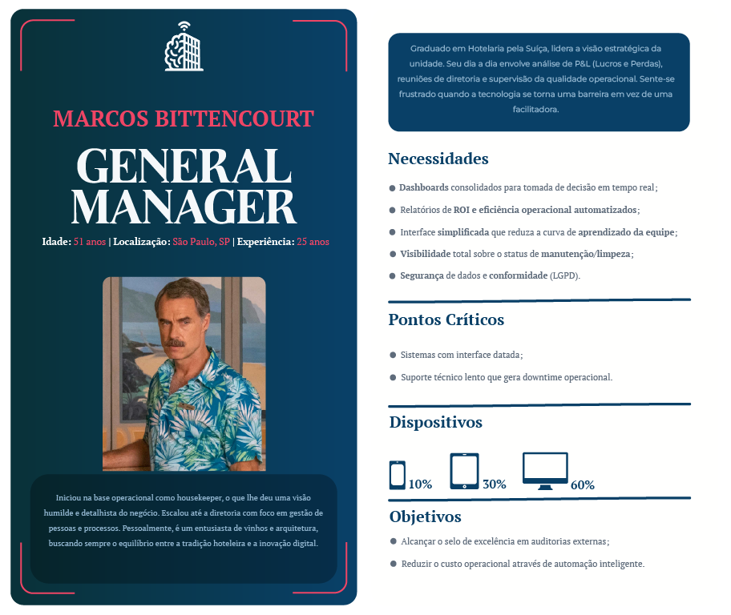

### Figura 2: Persona Front Office Manager
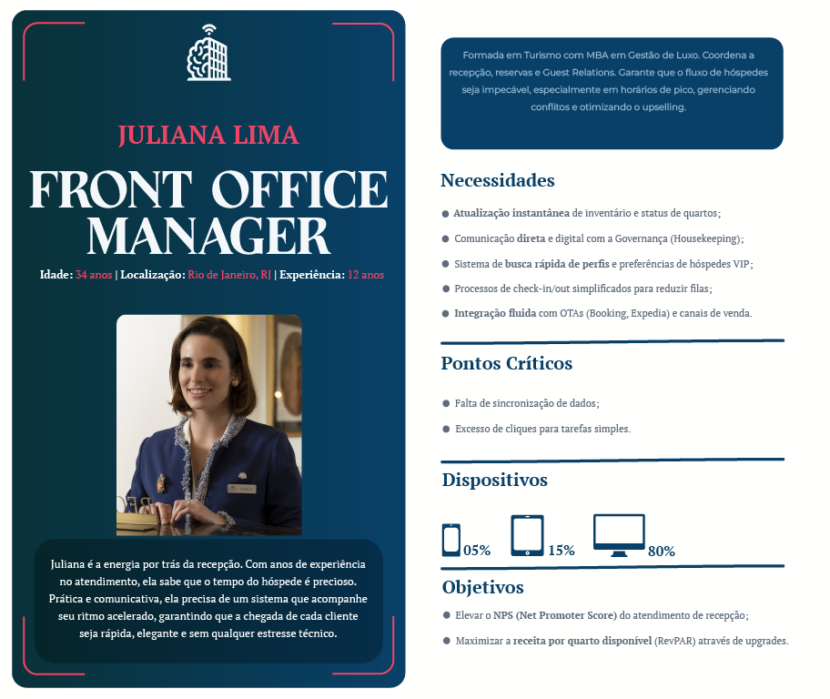

### Figura 3: Persona Executive Housekeeper
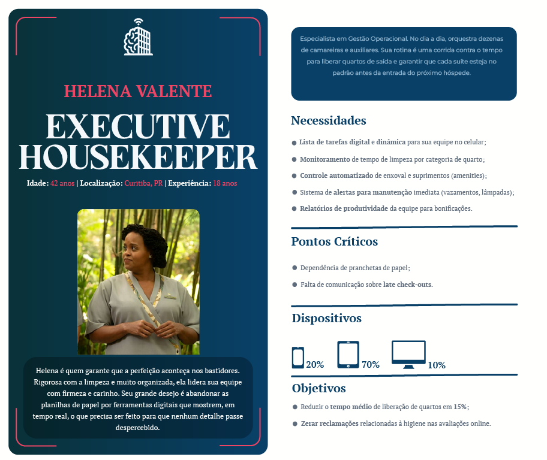

### Figura 4: Persona F&B Director
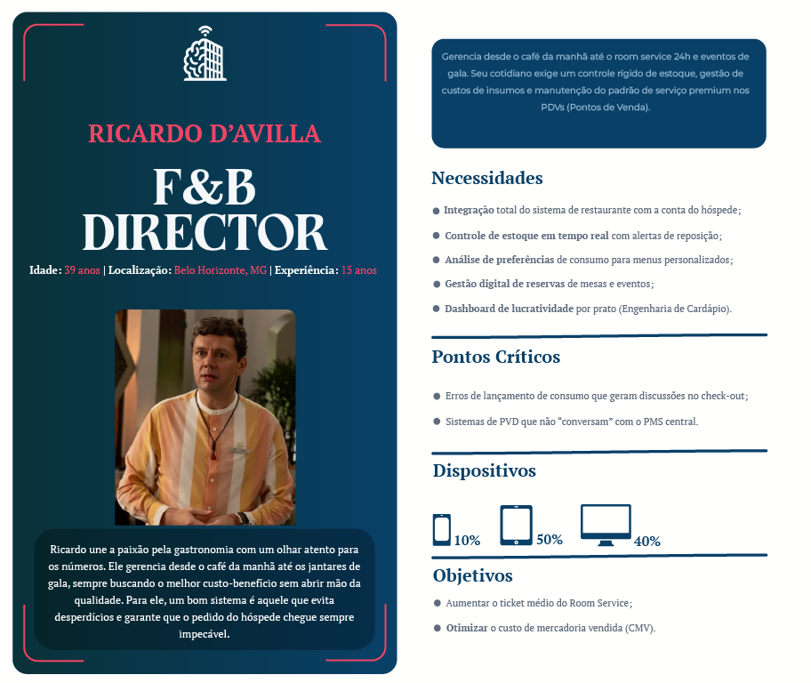

### Figura 5: Persona Revenue Manager
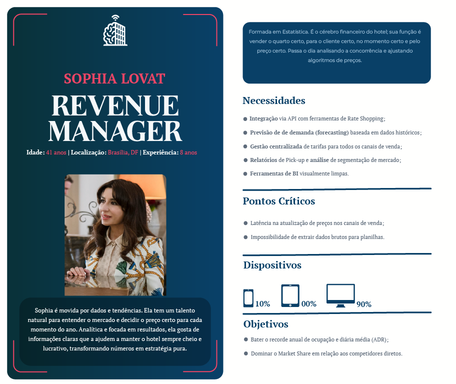

### Figura 6: Persona Chief Concierge
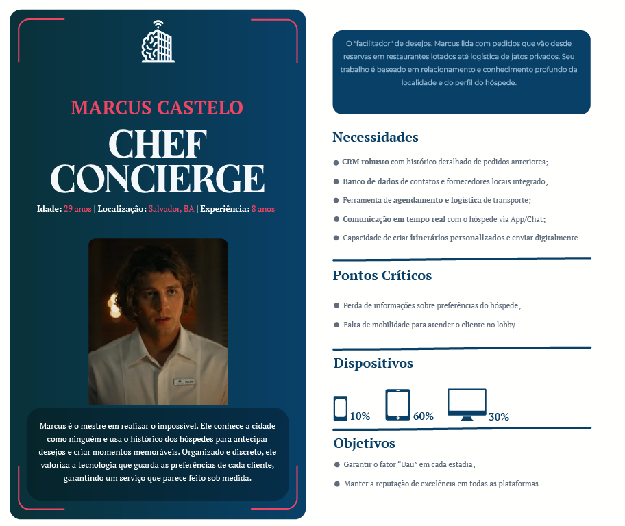

## 4.2 Mapa de Empatia
O mapa de empatia foi desenvolvido com o objetivo de compreender melhor as necessidades, comportamentos e desafios da persona definida para o sistema HotelMind. A partir dessa ferramenta, foi possível identificar como o usuário pensa, sente, age e quais dificuldades enfrenta durante a utilização do sistema.

O mapa de empatia contribuiu para entender melhor as expectativas do usuário e apoiar o desenvolvimento de um sistema mais eficiente e adequado às suas necessidades.

### Figura 1: Mapa de Empatia General Manager
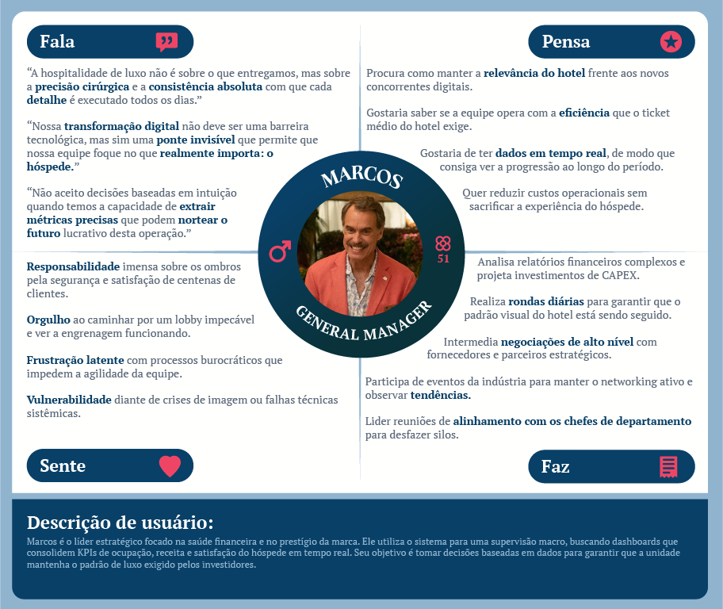

### Figura 2: Mapa de Empatia Front Office Manager
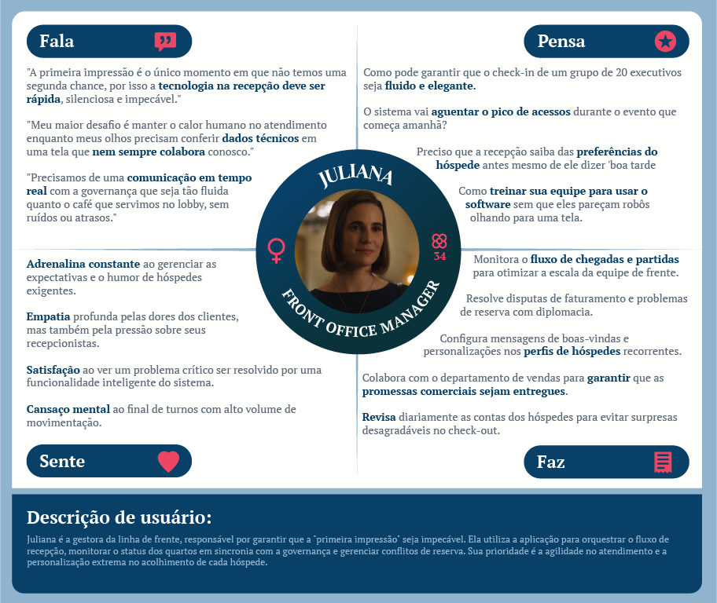

### Figura 3: Mapa de Empatia Executive Housekeeper
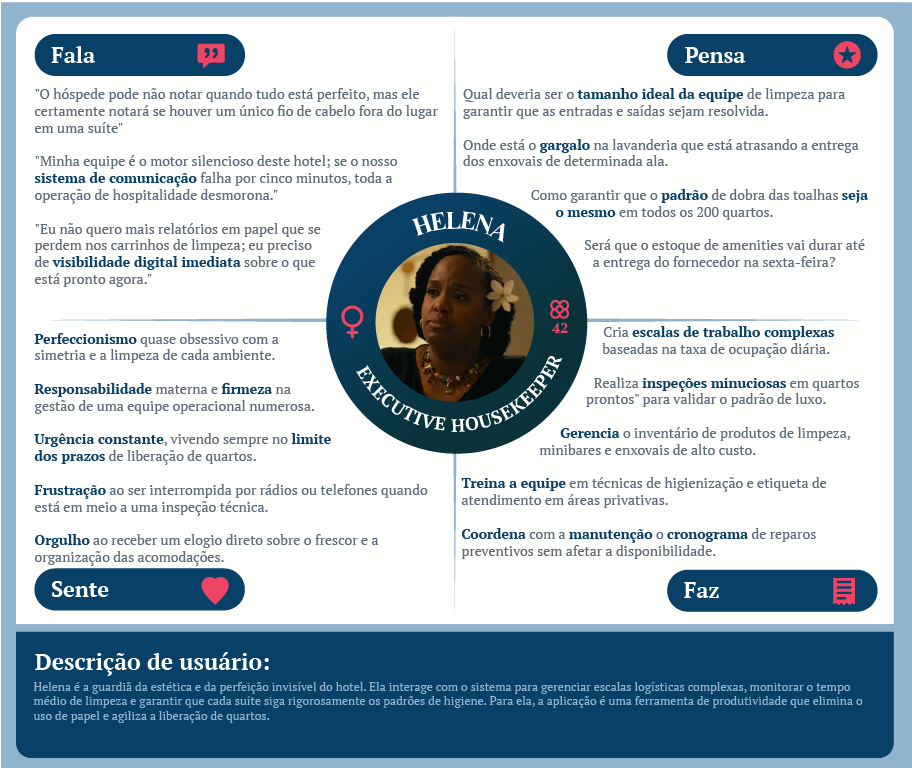

### Figura Figura 4: Mapa de Empatia F&B Director
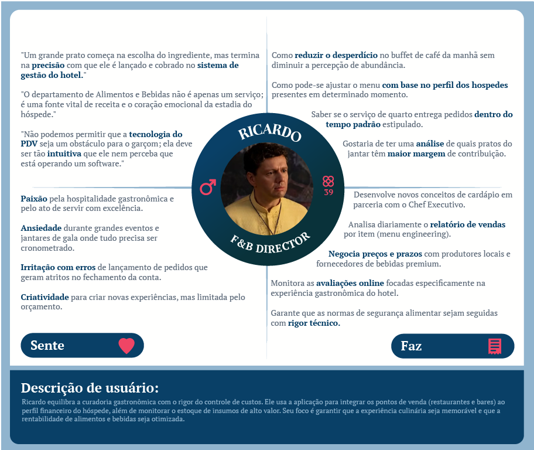

### Figura 5: Mapa de Empatia Revenue Manager
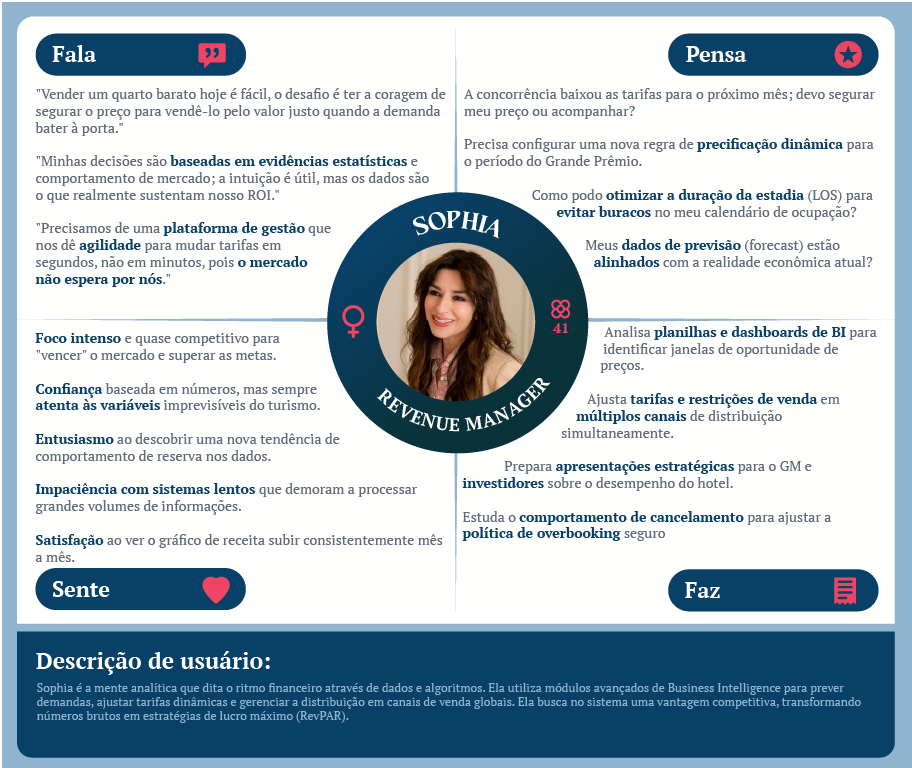

### Figura 6: Mapa de Empatia Chief Concierge
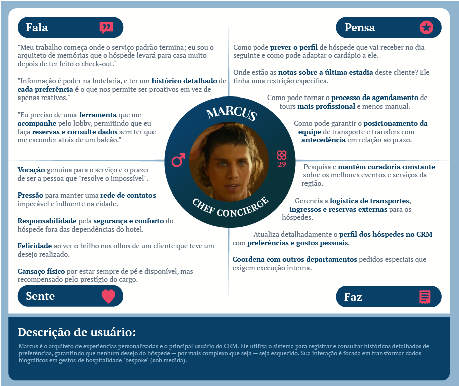

## 4.3 Protótipos das Interfaces
Nesta etapa apresentaremos os protótipos das telas, como foram elaboradas, e quais princípios
foram seguidos para chegarmos ao resultado em que fique claro, intuitivo e de fácil navegação
para usuário, procurando evitar erros e que ele se perca no caminho do que quer encontrar. Todas
as telas foram pensadas para melhor desempenho e atendimento a todos os tipos de públicos e
leitores.

### Protótipo | Tela de Início
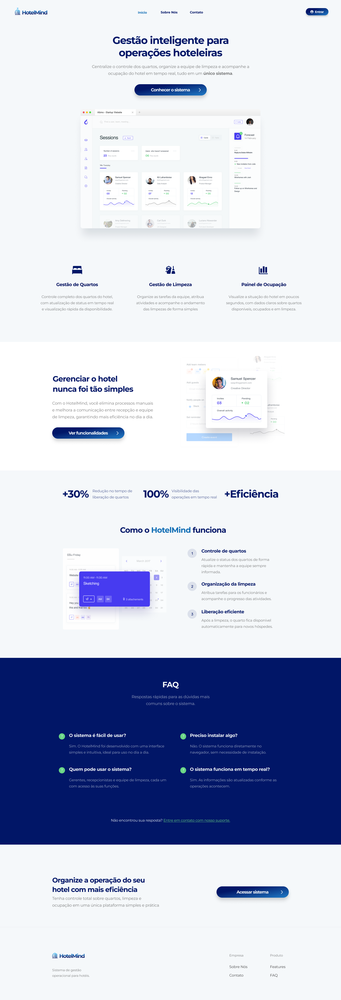

#### Objetivo
Apresentar o sistema HotelMind, comunicar seu valor e converter visitantes em usuários.

#### Princípios Gestálticos
- **Hierarquia Visual:** Destaque para título e CTAs.
- **Proximidade:** Conteúdo organizado por seções.
- **Similaridade:** Cards e ícones padronizados.
- **Figura-Fundo:** CTAs em destaque.
- **Continuidade:** Navegação fluida vertical.
- **Região Comum:** Agrupamento por blocos (features, FAQ, etc.).

#### Recomendações Ergonômicas
- CTAs claros e objetivos.
- Textos escaneáveis.
- Uso de imagens para apoio visual.
- Navegação simples.
- Conteúdo progressivo (do geral ao específico).

#### Regras de Ouro
- Consistência visual.
- Feedback em interações.
- Redução da carga de memória.
- Controle do usuário.
- Clareza na informação.
- Organização eficiente.

### Protótipo | Tela Sobre Nós
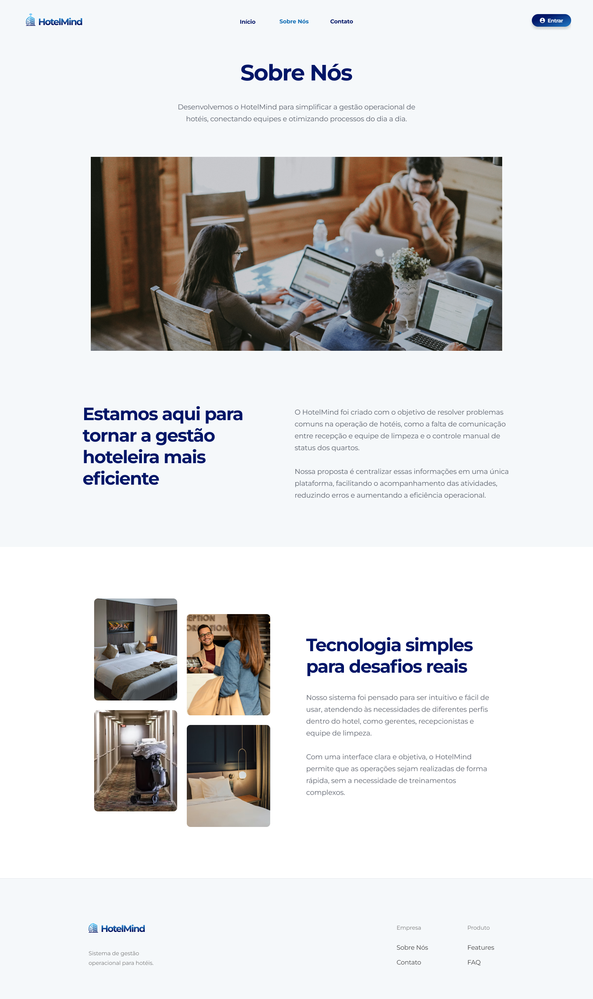

#### Objetivo
Apresentar a empresa, seu propósito e proposta de valor.

#### Princípios Gestálticos
- **Proximidade:** Textos e imagens organizados por contexto.
- **Figura-Fundo:** Destaque para títulos e blocos.
- **Hierarquia:** Título → imagem → texto.
- **Similaridade:** Elementos visuais consistentes.
- **Equilíbrio:** Distribuição entre imagem e texto.

#### Recomendações Ergonômicas
- Texto claro e direto.
- Uso de imagens reais para credibilidade.
- Layout equilibrado.
- Boa legibilidade.
- Organização por seções.

#### Regras de Ouro
- Consistência visual.
- Clareza na comunicação.
- Redução da carga cognitiva.
- Navegação simples.
- Informação relevante.

### Protótipo | Tela Fale Conosco
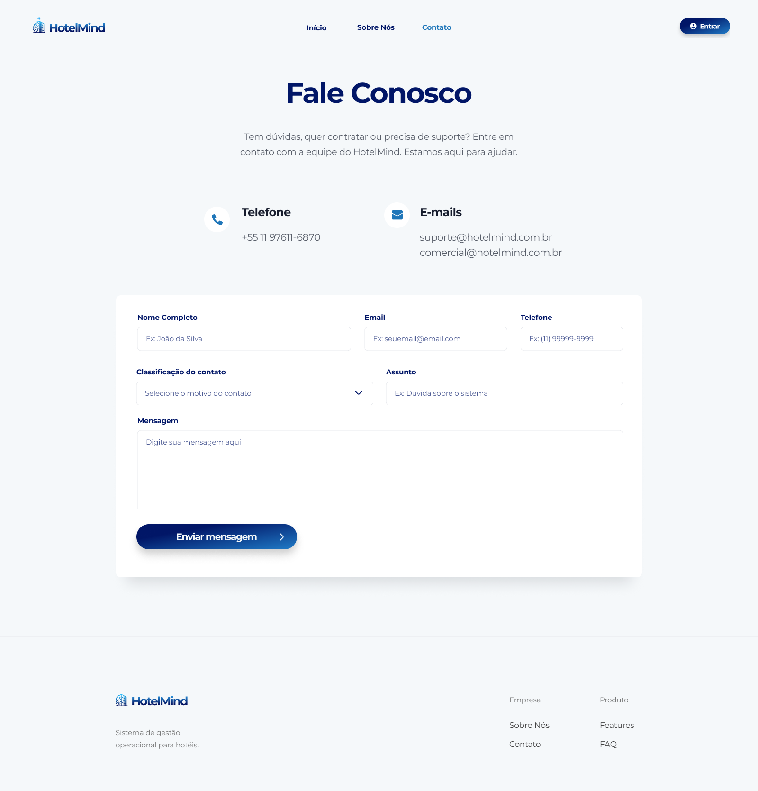

#### Objetivo
Permitir que o usuário entre em contato com a empresa para suporte, dúvidas ou contratação.

#### Princípios Gestálticos
- **Proximidade:** Campos do formulário agrupados.
- **Similaridade:** Inputs padronizados.
- **Figura-Fundo:** Formulário em destaque.
- **Hierarquia:** Contato → formulário → botão.
- **Alinhamento:** Estrutura organizada e limpa.

#### Recomendações Ergonômicas
- Validação de campos obrigatórios.
- Feedback após envio.
- Placeholder orientativo.
- Redução de esforço cognitivo.
- Clareza nos rótulos.

#### Regras de Ouro
- Feedback imediato.
- Prevenção de erros.
- Consistência.
- Controle do usuário.
- Simplicidade.
- Redução da carga de memória.

### Protótipo | Tela de Login
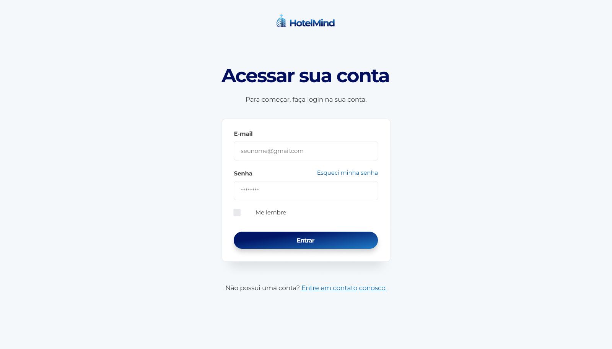

#### Objetivo
Permitir que o usuário acesse sua conta no sistema HotelMind de forma rápida, segura e intuitiva, inserindo suas credenciais (e-mail e senha), com suporte a recuperação de senha e opção de manter a sessão ativa.

#### Princípios Gestálticos
- **Proximidade:** Campos de e-mail, senha, checkbox e botão agrupados indicam relação funcional.
- **Similaridade:** Inputs possuem o mesmo estilo visual, facilitando reconhecimento.
- **Figura-Fundo:** O formulário central (card) se destaca do fundo.
- **Hierarquia Visual:** Título → subtítulo → formulário cria fluxo claro.
- **Alinhamento:** Elementos centralizados trazem organização.
- **Continuidade:** Ordem lógica (e-mail → senha → ação).

#### Recomendações Ergonômicas
- **Consistência:** Padrão visual uniforme (cores, tipografia, botões).
- **Feedback:** Retorno visual ao clicar em “Entrar” (loading, erro, sucesso).
- **Prevenção de erros:** Validação de campos (formato de e-mail, campos vazios).
- **Facilidade de uso:** Placeholder orientativo (ex: seunome@gmail.com).
- **Acessibilidade:** Bom contraste e legibilidade.
- **Eficiência:** Opção “Me lembre” reduz esforço futuro.

#### Regras de Ouro (Shneiderman)
- **Consistência:** Interface padronizada.
- **Atalhos:** “Me lembre” facilita acessos recorrentes.
- **Feedback informativo:** Mensagens de erro ou sucesso.
- **Diálogo simples:** Interface limpa e objetiva.
- **Prevenção de erros:** Campos guiados e recuperação de senha.
- **Reversão fácil:** “Esqueci minha senha”.
- **Controle do usuário:** Escolha de manter sessão ativa.
- **Redução da carga cognitiva:** Foco no essencial.

### Protótipo | Tela de Redefinir Senha
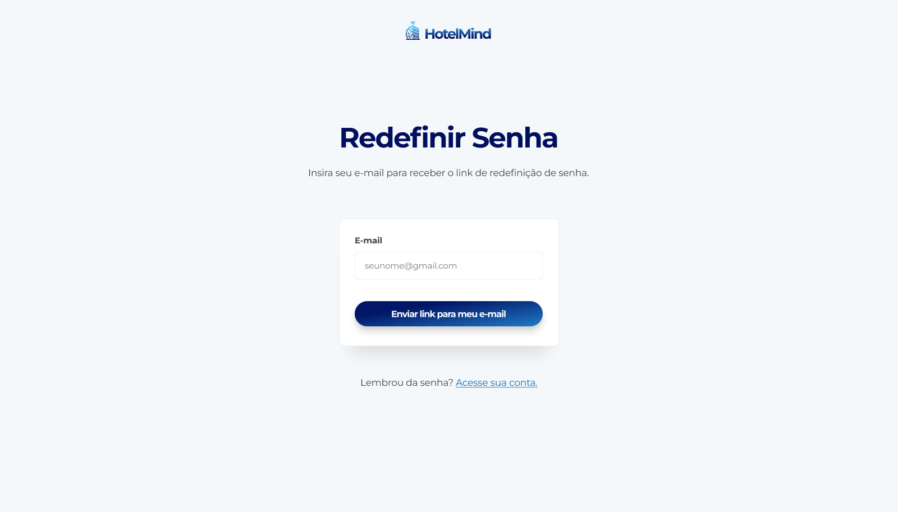

#### Objetivo
Permitir que o usuário recupere o acesso à conta por meio do envio de um link de redefinição de senha para o e-mail informado.

#### Princípios Gestálticos
- **Proximidade:** Campo de e-mail e botão agrupados indicam ação única.
- **Figura-Fundo:** Card central destaca a ação principal.
- **Hierarquia:** Título → instrução → campo → botão.
- **Pregnância (Simplicidade):** Interface minimalista focada em uma tarefa.
- **Continuidade:** Fluxo direto (inserir e-mail → enviar link).

#### Recomendações Ergonômicas
- Validação do e-mail antes do envio.
- Feedback claro após envio (ex: “link enviado”).
- Uso de autofill para reduzir erros.
- Contraste adequado para acessibilidade.
- Redução de esforço (apenas 1 campo).

#### Regras de Ouro
- Consistência com tela de login.
- Feedback imediato após ação.
- Prevenção de erros.
- Reversão simples (voltar ao login).
- Interface simples e objetiva.
- Redução da carga cognitiva.

## 4.4 Testes com Protótipos
Nesta seção você deve apresentar os testes realizados com usuários utilizando os protótipos de alta fidelidade desenvolvidos na seção anterior. O objetivo é avaliar a usabilidade, a clareza das informações e a adequação do design às necessidades das personas definidas no projeto.

Cada integrante do grupo deverá aplicar o teste com um usuário distinto, preferencialmente alinhado ao perfil das personas criadas. Devem ser definidas previamente as tarefas que o usuário deverá executar no protótipo (por exemplo: realizar um cadastro, buscar um produto, concluir uma compra).

Durante a aplicação do teste, registre observações sobre comportamentos, dúvidas, erros e comentários feitos pelo usuário, bem como o tempo necessário para a execução de cada tarefa. Ao final, colete o feedback do participante, destacando pontos positivos e aspectos a serem melhorados.

Os resultados obtidos por todos os integrantes devem ser consolidados, apresentando uma análise geral com os principais problemas encontrados, oportunidades de melhoria e as ações previstas para o projeto final. 
