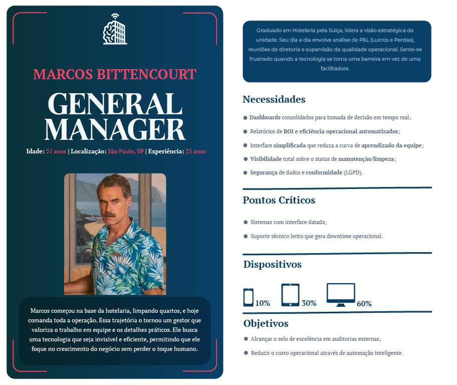
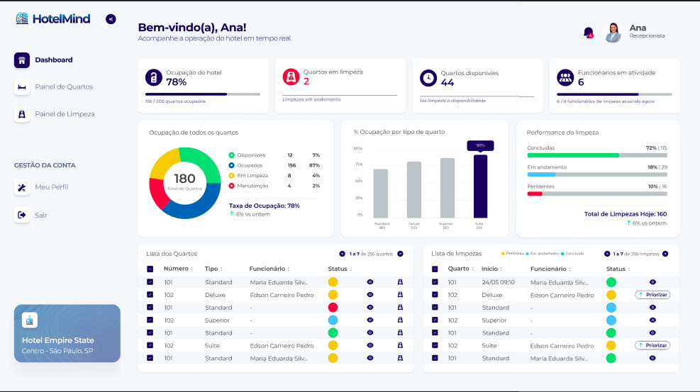
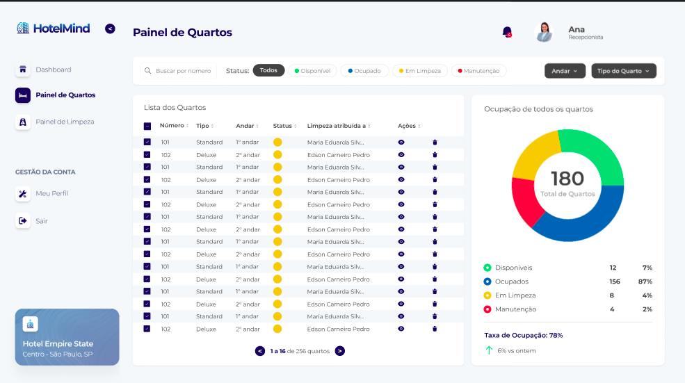
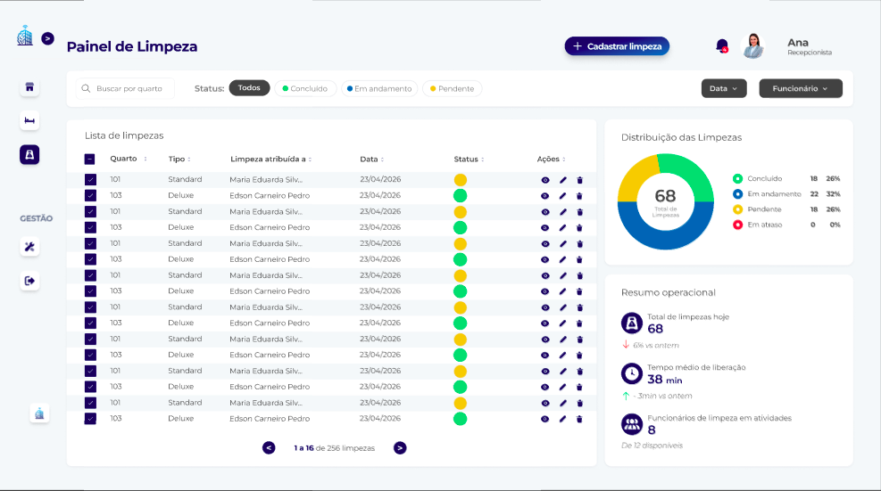

# 4. PROJETO DO DESIGN DE INTERAÇÃO

## 4.1 Personas
Nesta seção é apresentada a persona definida para representar um dos principais usuários do sistema HotelMind. A persona foi construída com base nas características dos usuários que utilizam o sistema diariamente, considerando suas necessidades, desafios e objetivos durante a utilização da plataforma.

A persona criada representa uma recepcionista de hotel, responsável por verificar a disponibilidade dos quartos, atualizar o status das ocupações e garantir a organização das informações no sistema. Essa persona foi utilizada para orientar o desenvolvimento das funcionalidades do sistema e facilitar a compreensão das necessidades dos usuários.

### Figura 1: Persona General Manager

### Figura 2: Persona Front Office Manager

### Figura 3: Persona Executive Housekeeper

### Figura 4: Persona F&B Director

### Figura 5: Persona Revenue Manager

### Figura 6: Persona Chief Concierge

## 4.2 Mapa de Empatia
O mapa de empatia foi desenvolvido com o objetivo de compreender melhor as necessidades, comportamentos e desafios da persona definida para o sistema HotelMind. A partir dessa ferramenta, foi possível identificar como o usuário pensa, sente, age e quais dificuldades enfrenta durante a utilização do sistema.

O mapa de empatia contribuiu para entender melhor as expectativas do usuário e apoiar o desenvolvimento de um sistema mais eficiente e adequado às suas necessidades.

### Figura 1: Mapa de Empatia General Manager

### Figura 2: Mapa de Empatia Front Office Manager

### Figura 3: Mapa de Empatia Executive Housekeeper

### Figura Figura 4: Mapa de Empatia F&B Director

### Figura 5: Mapa de Empatia Revenue Manager

### Figura 6: Mapa de Empatia Chief Concierge

## 4.3 Protótipos das Interfaces
Nesta etapa apresentaremos os protótipos das telas, como foram elaboradas, e quais princípios
foram seguidos para chegarmos ao resultado em que fique claro, intuitivo e de fácil navegação
para usuário, procurando evitar erros e que ele se perca no caminho do que quer encontrar. Todas
as telas foram pensadas para melhor desempenho e atendimento a todos os tipos de públicos e
leitores.

## Telas Institucionais
### Protótipo | Tela de Início

#### Objetivo da Tela
A tela Home funciona como a principal porta de entrada do site institucional do HotelMind. Seu objetivo é apresentar rapidamente a proposta do sistema, mostrando que a plataforma ajuda hotéis a centralizar o controle dos quartos, organizar a equipe de limpeza e acompanhar a ocupação em tempo real. A página também destaca as principais funcionalidades, explica como o sistema funciona e apresenta dúvidas frequentes, permitindo que o visitante compreenda o valor da solução antes de acessar ou entrar em contato.

#### Princípios Gestálticos
A tela utiliza proximidade ao agrupar título, subtítulo e botão principal em uma mesma área de destaque, facilitando o entendimento da mensagem inicial. A similaridade aparece nos cards de funcionalidades, que seguem o mesmo padrão visual e ajudam o usuário a reconhecer os principais módulos do sistema. O contraste entre fundo claro, botões azuis e seções destacadas reforça a relação figura-fundo, enquanto a organização vertical da página cria continuidade e guia o olhar do usuário de forma natural.

#### Recomendações Ergonômicas
A interface foi organizada para ter leitura leve, com textos curtos, títulos evidentes e espaçamentos generosos. Isso reduz a carga cognitiva e evita que o visitante se sinta sobrecarregado logo no primeiro contato com o sistema. Os botões possuem bom destaque visual e tamanho adequado, favorecendo o clique e deixando claro quais são as ações principais, como conhecer o sistema ou acessar a plataforma.

#### Regras de Ouro de Shneiderman
A tela mantém consistência visual por meio do uso repetido das mesmas cores, tipografia, botões e estrutura de navegação. Também favorece a eficiência do usuário ao oferecer atalhos claros no menu superior e nos botões de chamada para ação. A prevenção de erros aparece na clareza dos textos dos botões, que indicam exatamente o que o usuário pode esperar ao clicar, enquanto a organização das seções reduz a necessidade de memorização.

### Protótipo | Tela Sobre Nós

#### Objetivo da Tela
A tela Sobre Nós apresenta o propósito do HotelMind e explica por que o sistema foi desenvolvido. Ela mostra que a plataforma busca resolver problemas comuns da operação hoteleira, como falhas de comunicação entre recepção e limpeza, controle manual dos quartos e falta de visibilidade sobre o andamento das atividades. A tela também reforça que o sistema foi pensado para ser simples, intuitivo e adequado aos diferentes perfis de usuários dentro do hotel.

#### Princípios Gestálticos
A proximidade aparece na organização dos blocos de texto, em que títulos e parágrafos relacionados ficam próximos e formam unidades claras de informação. A similaridade é percebida na repetição do estilo dos títulos, imagens e espaçamentos, criando unidade visual ao longo da página. As imagens funcionam como figura de apoio ao conteúdo textual, enquanto o fundo claro mantém boa separação visual e favorece a leitura.

#### Recomendações Ergonômicas
A tela utiliza bastante espaço em branco para deixar a leitura mais confortável e evitar excesso de informação. Os textos são divididos em blocos, o que facilita a compreensão progressiva da proposta do projeto. A hierarquia visual entre títulos maiores e parágrafos menores permite que o usuário escaneie rapidamente o conteúdo e aprofunde a leitura apenas nas partes de maior interesse.

#### Regras de Ouro de Shneiderman
A consistência é mantida pela repetição da identidade visual do HotelMind, com o mesmo menu, cores e estilo dos demais protótipos. A tela reduz a carga de memória porque apresenta as informações em uma sequência lógica, sem exigir conhecimento prévio do sistema. O controle do usuário é garantido pelo menu superior, que permite navegar livremente para outras páginas, como Home, Contato ou Acessar Conta.

### Protótipo | Tela Fale Conosco

#### Objetivo da Tela
A tela de Contato permite que usuários, interessados ou clientes entrem em contato com a equipe do HotelMind para tirar dúvidas, solicitar suporte ou demonstrar interesse em contratação. O formulário solicita nome, e-mail, telefone, classificação do contato, assunto e mensagem, ajudando a organizar melhor o atendimento. O campo de classificação é importante porque direciona a solicitação para o tipo correto de atendimento, como suporte técnico, dúvida comercial ou interesse em contratação.

#### Princípios Gestálticos
A proximidade organiza os campos em grupos lógicos, separando informações pessoais, motivo do contato e mensagem. A similaridade aparece no padrão dos inputs, que possuem o mesmo estilo visual e facilitam o reconhecimento dos campos preenchíveis. O card branco do formulário se destaca sobre o fundo claro, criando uma boa relação figura-fundo, enquanto a ordem dos campos segue uma continuidade natural de preenchimento.

#### Recomendações Ergonômicas
A tela foi pensada para facilitar o preenchimento e evitar dúvidas durante o envio da mensagem. Os placeholders ajudam o usuário a entender como preencher cada campo, enquanto o tamanho dos inputs e o espaçamento entre eles tornam a interação mais confortável. O botão “Enviar mensagem” aparece no final do formulário, respeitando o fluxo natural da ação e deixando clara a etapa final do processo.

#### Regras de Ouro de Shneiderman
A tela mantém consistência com as demais páginas institucionais por meio da identidade visual, botões e campos padronizados. A prevenção de erros aparece nos labels claros e no campo de classificação, que ajuda a evitar mensagens sem contexto. O feedback informativo deve ocorrer após o envio, com uma confirmação de sucesso ou alerta sobre campos obrigatórios não preenchidos, garantindo que o usuário saiba o resultado da ação.

## Telas de Acesso
### Protótipo | Tela de Login

#### Objetivo da Tela
A tela “Acessar sua conta” permite que usuários cadastrados entrem no sistema HotelMind por meio de e-mail e senha. Ela separa o ambiente institucional da área interna da plataforma, onde ficam as funcionalidades operacionais. A tela também oferece opções auxiliares, como “Me lembre”, “Esqueci minha senha” e um link de contato para usuários que ainda não possuem uma conta.

#### Princípios Gestálticos
A proximidade agrupa todos os elementos de autenticação dentro de um único card, facilitando o entendimento do fluxo de login. A similaridade aparece nos campos de e-mail e senha, que seguem o mesmo padrão visual. O card branco sobre o fundo claro e o botão azul em destaque criam figura-fundo, direcionando a atenção para a ação principal. A continuidade guia o usuário de cima para baixo, da identificação da marca até o botão de entrada.

#### Recomendações Ergonômicas
A tela é limpa e objetiva, com poucos elementos para evitar distrações. Os campos possuem tamanho confortável para digitação, e o link de recuperação de senha fica próximo ao campo de senha, aparecendo exatamente onde o usuário pode precisar dele. O botão “Entrar” tem destaque suficiente para ser identificado como ação principal, enquanto o link para contato fica separado para não confundir o fluxo de autenticação.

#### Regras de Ouro de Shneiderman
A tela segue a consistência visual do sistema e deve oferecer feedback claro quando o login for realizado com sucesso ou quando houver erro de e-mail, senha ou campos vazios. A prevenção de erros ocorre por meio de validações e mensagens próximas aos campos correspondentes. O controle e liberdade do usuário aparecem nas opções de recuperar senha ou entrar em contato caso não tenha acesso.

### Protótipo | Tela de Redefinir Senha

#### Objetivo da Tela
A tela “Redefinir Senha” permite que o usuário solicite um link de recuperação quando esquecer sua senha. O fluxo é simples: o usuário informa seu e-mail e clica no botão para receber o link de redefinição. A tela também oferece um caminho de retorno para a tela de acesso, caso o usuário lembre a senha ou tenha acessado a página por engano.

#### Princípios Gestálticos
A proximidade une o campo de e-mail e o botão dentro do mesmo card, mostrando que fazem parte da mesma ação. A similaridade mantém o padrão visual da tela de login, reforçando familiaridade. O card centralizado e o botão azul criam destaque visual, enquanto a leitura vertical da página conduz o usuário naturalmente da instrução ao envio do link.

#### Recomendações Ergonômicas
A tela possui baixa carga cognitiva, pois solicita apenas uma informação. O texto explicativo é direto e evita termos técnicos, ajudando o usuário a entender exatamente o que precisa fazer. O botão “Enviar link para meu e-mail” é claro e comunica o resultado esperado da ação. Após o envio, o sistema deve apresentar uma mensagem de sucesso ou erro para evitar insegurança.

#### Regras de Ouro de Shneiderman
A consistência é mantida com o mesmo padrão visual da área de acesso. O feedback informativo é essencial, pois o usuário precisa saber se o link foi enviado, se o e-mail não foi encontrado ou se ocorreu algum problema. A prevenção de erros aparece na validação do e-mail, enquanto o controle e liberdade são garantidos pelo link para retornar à tela de login.

## Área Interna do Sistema
### Protótipo | Tela Início — Gerente

#### Objetivo da Tela
A tela inicial do gerente funciona como uma visão geral da operação do hotel. Ela apresenta indicadores e gráficos que ajudam o gerente a entender rapidamente a situação do hotel, como ocupação, limpezas em atraso, tempo médio de liberação, funcionários em atividade, desempenho da limpeza e listas resumidas de quartos e limpezas. A proposta é que essa tela funcione como um painel de controle para apoiar decisões rápidas no dia a dia.

#### Princípios Gestálticos
A proximidade organiza os indicadores em cards no topo, separando cada dado em uma unidade clara. A similaridade aparece no padrão visual desses cards, que usam a mesma estrutura de ícone, número e descrição. A figura-fundo é reforçada pelos cards brancos sobre fundo claro, enquanto a continuidade organiza a leitura da visão geral para os gráficos e, depois, para as listas operacionais.

#### Recomendações Ergonômicas
A tela reduz a carga cognitiva ao dividir dados operacionais em blocos visuais bem separados. Os status e indicadores usam cores para facilitar a leitura rápida, especialmente em situações que exigem atenção, como atrasos ou manutenção. O menu lateral fixo melhora a navegação e permite que o gerente acesse rapidamente os módulos principais sem perder o contexto.

#### Regras de Ouro de Shneiderman
A consistência aparece no uso de padrões visuais repetidos em cards, tabelas e gráficos. O feedback informativo é dado pelos indicadores e status em tempo real, permitindo que o gerente entenda rapidamente o estado da operação. A prevenção de erros ocorre pela separação clara das informações, e os atalhos de navegação tornam o uso mais eficiente para usuários frequentes.

### Protótipo | Tela Início - Recepcionista

#### Objetivo
Permitir que a recepcionista acompanhe em tempo real a situação geral do hotel, incluindo ocupação, disponibilidade dos quartos e status das limpezas.

#### Princípios Gestálticos
- **Proximidade:** Cards e gráficos agrupados por categoria facilitam a leitura operacional.
- **Figura-Fundo:** Os cards em destaque direcionam atenção para informações principais.
- **Hierarquia:** Indicadores principais aparecem antes de gráficos e tabelas.
- **Pregnância:** Interface limpa e objetiva com foco no monitoramento rápido.
- **Continuidade:** Fluxo visual conduz o usuário dos indicadores gerais para detalhes operacionais.

#### Recomendações Ergonômicas
- Uso de cores para identificar rapidamente o status dos quartos.
- Informações organizadas em blocos para reduzir sobrecarga visual.
- Ícones intuitivos para facilitar reconhecimento das funcionalidades.
- Layout responsivo e consistente com as demais telas.
- Redução da carga cognitiva através de dashboards resumidos.

#### Regras de Ouro
- Consistência visual com o dashboard do gerente.
- Feedback visual imediato dos status operacionais.
- Interface simples e objetiva.
- Prevenção de erros ao limitar ações da recepcionista.
- Organização lógica das informações.

--------
### Protótipo | Tela Painel de Quartos — Gerente

#### Objetivo da Tela
A tela Painel de Quartos permite ao gerente visualizar e gerenciar os quartos cadastrados no hotel. A lista apresenta número, tipo, andar, status, funcionário responsável pela limpeza e ações como visualizar, editar, excluir e atribuir limpeza. A tela também inclui filtros por número, status, andar e tipo de quarto, além de um gráfico de ocupação para complementar a análise da disponibilidade do hotel.

#### Princípios Gestálticos
A proximidade aparece na área de filtros, em que busca, status, andar e tipo ficam agrupados para indicar que todos controlam a listagem. A similaridade ocorre nas linhas da tabela, que repetem o mesmo padrão de colunas e ações. O gráfico lateral se diferencia da lista, mas continua visualmente conectado por meio do mesmo estilo de card. A continuidade organiza o fluxo da esquerda para a direita: primeiro o usuário filtra, depois consulta a lista e, por fim, analisa o gráfico.

#### Recomendações Ergonômicas
A tela prioriza a lista porque a principal tarefa é consultar e gerenciar quartos. Os filtros reduzem o esforço de busca, principalmente em hotéis com muitos registros. As cores dos status facilitam a identificação visual de quartos disponíveis, ocupados, em limpeza ou em manutenção. Os ícones de ação economizam espaço, mas devem ser acompanhados de tooltip ou legenda no sistema final para evitar dúvidas.

#### Regras de Ouro de Shneiderman
A tela mantém consistência com os demais painéis do sistema, usando o mesmo padrão de filtros, tabelas, botões e cores. O feedback informativo ocorre quando filtros alteram a lista e quando o gráfico reflete a distribuição dos quartos. A prevenção de erros é aplicada principalmente nas ações de exclusão e atribuição de limpeza, que devem abrir modais de confirmação ou preenchimento antes de qualquer alteração.

### Protótipo | Tela Quartos - Recepcionista

#### Objetivo
Permitir que a recepcionista visualize rapidamente o mapa hoteleiro, acompanhando a situação dos quartos em tempo real.

#### Princípios Gestálticos
- **Proximidade:** Quartos organizados em grade facilitam percepção por andar.
- **Figura-Fundo:** Cores destacam diferentes status dos quartos.
- **Hierarquia:** Informações principais dos quartos aparecem primeiro.
- **Pregnância:** Estrutura visual simples favorece leitura rápida.
- **Continuidade:** Fluxo visual natural entre filtros e mapa de quartos.

#### Recomendações Ergonômicas
- Uso de cores padronizadas para cada status.
- Filtros simples para facilitar localização dos quartos.
- Informações resumidas para evitar excesso visual.
- Modal informativo ao clicar em um quarto ocupado.
- Interface intuitiva com baixa curva de aprendizado.

#### Regras de Ouro
- Consistência com os demais painéis do sistema.
- Feedback visual imediato ao selecionar quartos.
- Minimização da carga cognitiva.
- Prevenção de ações indevidas pela recepcionista.
- Clareza na identificação dos status.

--------
### Protótipo | Sub Tela Painel de Quartos - Modal Cadastrar Quarto — Gerente & Recepcionista

#### Objetivo da Tela
O modal Cadastrar Quarto permite que o gerente inclua um novo quarto no sistema sem sair do Painel de Quartos. O formulário solicita informações essenciais, como tipo, andar, descrição e status inicial. A proposta é manter o cadastro simples e adequado ao escopo do projeto, registrando apenas os dados necessários para que o quarto seja exibido e gerenciado no painel.

#### Princípios Gestálticos
A proximidade organiza os campos por relação: tipo e andar aparecem juntos como dados estruturais, descrição aparece como complemento e status inicial aparece como escolha operacional. A similaridade é mantida nos campos e botões de status, enquanto o fundo escurecido destaca o modal como figura principal. A continuidade conduz o usuário do preenchimento das informações básicas até a escolha do status e confirmação do cadastro.

#### Recomendações Ergonômicas
O modal é objetivo e evita campos desnecessários, tornando o cadastro mais rápido. Os campos obrigatórios são sinalizados, e a descrição aparece como opcional para não gerar obrigação indevida. O botão principal tem destaque visual, enquanto o botão cancelar oferece uma saída segura caso o usuário tenha aberto o modal por engano.

#### Regras de Ouro de Shneiderman
A prevenção de erros aparece na indicação de campos obrigatórios e na necessidade de validação, como impedir cadastro duplicado de quarto. A consistência é mantida com o padrão dos demais modais. O feedback deve informar quando o quarto for cadastrado com sucesso ou quando houver campos inválidos, e o controle do usuário é garantido pela opção de cancelar ou fechar a janela.

### Protótipo | Sub Tela Painel de Quartos - Modal Visualizar Quarto — Gerente & Recepcionista & Limpeza

#### Objetivo da Tela
O modal Visualizar Quarto permite consultar as informações de um quarto específico sem realizar alterações diretas. Ele mostra dados como número, tipo, andar, descrição e status atual. Essa tela ajuda o usuário a confirmar informações antes de editar, excluir ou atribuir uma limpeza, funcionando como uma etapa de consulta segura.

#### Princípios Gestálticos
A proximidade agrupa os dados principais do quarto em uma estrutura clara. A similaridade com os modais de cadastro e edição facilita o reconhecimento, mesmo sendo uma tela de leitura. O fundo escurecido reforça a relação figura-fundo e mantém o foco no quarto selecionado, enquanto a continuidade segue a mesma ordem lógica dos demais formulários.

#### Recomendações Ergonômicas
A tela apresenta apenas informações essenciais, reduzindo esforço de leitura. Como é uma visualização, os campos devem parecer bloqueados ou somente leitura, evitando que o usuário tente editar dados por engano. A estrutura simples favorece uma consulta rápida e objetiva.

#### Regras de Ouro de Shneiderman
A consistência aparece na semelhança com os demais modais do sistema. A prevenção de erros ocorre por não permitir edição direta na tela de visualização. O controle e liberdade estão presentes no botão de fechar, que permite retornar ao Painel de Quartos sem modificar nenhuma informação.

### Protótipo | Sub Tela Painel de Quartos - Modal Editar Quarto — Gerente & Recepcionista

#### Objetivo da Tela
O modal Editar Quarto permite que o gerente altere informações de um quarto já cadastrado. Os dados aparecem preenchidos previamente, permitindo revisar e modificar apenas o que for necessário, como tipo, andar, descrição ou status. A ação principal é salvar as alterações, enquanto o cancelamento permite abandonar a edição sem impacto no registro.

#### Princípios Gestálticos
A proximidade mantém os campos organizados de forma semelhante ao cadastro, facilitando a compreensão. A similaridade visual reduz o esforço de aprendizado, pois o usuário reconhece o padrão do formulário. O modal em destaque sobre o fundo escurecido reforça figura-fundo, e a continuidade orienta o usuário da revisão dos dados até a confirmação da edição.

#### Recomendações Ergonômicas
Trazer os dados preenchidos reduz retrabalho e evita que o usuário precise memorizar informações. Os status em formato de botões ajudam a padronizar o preenchimento e evitam erros de digitação. A ação principal fica destacada, mas a opção de cancelar permanece visível para garantir segurança durante a edição.

#### Regras de Ouro de Shneiderman
A consistência se mantém pela semelhança com o cadastro de quarto. A prevenção de erros é importante principalmente nas alterações de status, já que algumas mudanças podem exigir regras de negócio, como não liberar diretamente um quarto ocupado sem passar por limpeza. O feedback deve confirmar que as alterações foram salvas, e o usuário deve poder cancelar a ação antes de concluir.

### Protótipo | Sub Tela Painel de Quartos - Modal Atribuir Limpeza ao Quarto — Gerente & Recepcionista

#### Objetivo da Tela
O modal Atribuir Limpeza permite vincular um funcionário de limpeza a um quarto específico. Ele é importante para organizar a operação e garantir que quartos que precisam de limpeza tenham um responsável definido. O formulário solicita o quarto, o funcionário e uma descrição opcional, além de apresentar uma mensagem de apoio informando que apenas quartos em limpeza podem receber atribuição.

#### Princípios Gestálticos
A proximidade agrupa os campos principais da atribuição, indicando que quarto e funcionário formam o vínculo central da tarefa. A similaridade dos campos de seleção facilita o entendimento de que as informações devem ser escolhidas a partir de listas. O modal destacado sobre a tela escurecida mantém o foco na atribuição, e a continuidade acompanha a lógica natural da ação: selecionar quarto, escolher funcionário, adicionar observação e confirmar.

#### Recomendações Ergonômicas
O uso de campos de seleção reduz erros, pois evita digitação manual de quartos ou nomes de funcionários. A mensagem de apoio funciona como orientação contextual e ajuda o usuário a entender a regra da ação. O botão “Atribuir limpeza” fica destacado para indicar a confirmação, enquanto cancelar oferece uma saída segura.

#### Regras de Ouro de Shneiderman
A prevenção de erros é o ponto mais importante, pois a tela deixa clara a regra de que apenas quartos em limpeza podem receber atribuição. A consistência aparece no padrão visual dos modais. O feedback deve informar quando a limpeza for atribuída com sucesso, e o controle do usuário é garantido pela possibilidade de cancelar antes da confirmação.

### Protótipo | Sub Tela Painel de Quartos - Modal Excluir Quarto — Gerente & Recepcionista

#### Objetivo da Tela
O modal Excluir Quarto confirma uma ação crítica antes de remover um quarto do sistema. Ele apresenta uma pergunta direta, um ícone de lixeira e uma mensagem informando que a ação não poderá ser desfeita. A tela existe para impedir exclusões acidentais e garantir que o gerente confirme conscientemente a remoção do registro.

#### Princípios Gestálticos
A figura-fundo é forte, pois o fundo escurecido direciona a atenção para o modal. A proximidade agrupa ícone, mensagem e aviso como uma unidade de alerta. A similaridade mantém a estrutura dos demais modais, mas o uso do vermelho diferencia a ação destrutiva. A continuidade conduz o usuário da leitura do aviso até a decisão entre cancelar ou excluir.

#### Recomendações Ergonômicas
A tela é curta e direta para não confundir o usuário. O vermelho comunica risco, enquanto o botão cancelar permanece visível como alternativa segura. A mensagem deve ser clara e mencionar o quarto selecionado para reduzir a chance de excluir o registro errado.

#### Regras de Ouro de Shneiderman
A prevenção de erros é a principal regra aplicada, já que o sistema exige confirmação antes de excluir. O controle e liberdade aparecem na opção de cancelar. O feedback deve informar se o quarto foi excluído com sucesso ou se não pôde ser removido, e a consistência visual se mantém com os demais modais de confirmação.

## Painel de Limpezas
### Protótipo | Tela Painel de Limpezas - Gerente

#### Objetivo da Tela
A tela Painel de Limpezas permite acompanhar e gerenciar as atividades de limpeza do hotel. A lista mostra quarto, tipo, funcionário responsável, data, status e ações disponíveis. A tela também possui filtros por quarto, status, data e funcionário, além de gráficos e resumo operacional que ajudam o gerente a entender a distribuição das tarefas, o total de limpezas, o tempo médio de liberação e a quantidade de funcionários em atividade.

#### Princípios Gestálticos
A proximidade agrupa busca e filtros no topo, indicando que todos servem para controlar a lista. A similaridade das linhas da tabela facilita comparação entre tarefas. O gráfico e o resumo no lado direito aparecem em cards separados, criando figura-fundo e distinguindo análise visual da lista operacional. A continuidade conduz o usuário da busca para a listagem e depois para os indicadores de apoio.

#### Recomendações Ergonômicas
A tela foi pensada para uma rotina operacional dinâmica, em que o usuário precisa identificar rapidamente o status das limpezas. As cores dos status facilitam a leitura, os filtros reduzem o esforço de busca e as ações ficam no final de cada linha para manter previsibilidade. A tabela ocupa a maior área porque a principal tarefa é gerenciar registros, enquanto os gráficos funcionam como apoio visual.

#### Regras de Ouro de Shneiderman
A consistência aparece no padrão usado também no Painel de Quartos. O feedback informativo ocorre por meio dos status, filtros e gráficos. A prevenção de erros é aplicada nas ações sensíveis, como editar ou excluir, que abrem modais antes da conclusão. O controle e liberdade do usuário aparecem na possibilidade de filtrar, consultar, editar, excluir ou cancelar ações sem perder o contexto.

### Protótipo | Tela Limpeza - Recepcionista

#### Objetivo
Permitir que a recepcionista acompanhe o andamento das limpezas dos quartos de forma visual e organizada.

#### Princípios Gestálticos
- **Proximidade:** Informações de limpeza agrupadas por status.
- **Figura-Fundo:** Indicadores visuais destacam limpezas pendentes e concluídas.
- **Hierarquia:** Status mais importantes aparecem em destaque.
- **Pregnância:** Interface simples focada em acompanhamento operacional.
- **Continuidade:** Fluxo visual favorece acompanhamento sequencial das tarefas.

#### Recomendações Ergonômicas
- Uso de indicadores visuais para facilitar identificação rápida.
- Layout organizado em listas e cards.
- Contraste adequado para acessibilidade.
- Informações resumidas para facilitar monitoramento.
- Padronização visual com as demais telas do sistema.

#### Regras de Ouro
- Consistência visual entre módulos.
- Feedback imediato sobre status das limpezas.
- Simplicidade operacional.
- Redução de sobrecarga visual.
- Clareza nas informações exibidas.

-------
### Protótipo | Sub Tela Painel de Limpezas - Modal Cadastrar Limpeza - Gerente & Recepcionista

#### Objetivo da Tela
O modal Cadastrar Limpeza permite registrar uma nova atividade de limpeza. O formulário solicita quarto, data, funcionário responsável, observação opcional e status inicial. A proposta é permitir que o gerente ou recepcionista crie uma tarefa de limpeza de forma rápida, registrando as informações essenciais para acompanhamento posterior.

#### Princípios Gestálticos
A proximidade organiza os campos principais na parte superior e deixa observação e status como complementos da tarefa. A similaridade dos campos de seleção ajuda o usuário a entender que quarto, data e funcionário devem ser escolhidos. O modal em destaque sobre o fundo escurecido reforça figura-fundo, enquanto a continuidade segue o fluxo natural de cadastro.

#### Recomendações Ergonômicas
A tela possui poucos campos e boa separação visual, tornando o cadastro simples. Campos obrigatórios são identificados, e a observação é opcional para evitar preenchimento desnecessário. O status em formato de botões coloridos ajuda a padronizar a informação e evita variações de escrita.

#### Regras de Ouro de Shneiderman
A consistência aparece no padrão do modal. A prevenção de erros ocorre pelo uso de campos obrigatórios e seleção de dados já cadastrados. O feedback deve confirmar o cadastro ou indicar campos incorretos, enquanto o controle e liberdade são garantidos pelas opções de cancelar ou fechar.

### Protótipo | Sub Tela Painel de Limpezas - Modal Detalhes da Limpeza - Gerente & Recepcionista & Limpeza

#### Objetivo da Tela
O modal Detalhes da Limpeza permite consultar as informações completas de uma atividade já cadastrada, como quarto, data, funcionário, observação, última atualização e status. Ele funciona como uma tela de leitura, permitindo que o usuário compreenda o andamento da tarefa sem fazer alterações diretas.

#### Princípios Gestálticos
A proximidade agrupa informações essenciais no início do modal e dados complementares, como observação e última atualização, em seguida. A similaridade mantém o padrão dos formulários, facilitando a leitura. O fundo escurecido destaca o modal como figura principal, e a continuidade organiza a leitura de forma vertical e sequencial.

#### Recomendações Ergonômicas
A tela evita excesso de dados e apresenta apenas informações necessárias para entender a limpeza selecionada. Os campos preenchidos devem indicar modo de visualização, evitando que o usuário tente editar diretamente. O status visual com cores facilita a interpretação rápida da situação da tarefa.

#### Regras de Ouro de Shneiderman
A consistência é mantida pela estrutura semelhante aos outros modais. A minimização da carga de memória ocorre porque todas as informações relevantes estão visíveis. A prevenção de erros aparece por não permitir alterações diretas, e o controle do usuário é garantido pelo fechamento do modal.

### Protótipo | Sub Tela Painel de Limpezas - Modal Excluir Limpeza - Gerente & Recepcionista

#### Objetivo da Tela
O modal Excluir Limpeza confirma a remoção de uma atividade de limpeza. Como se trata de uma ação crítica, ele exibe uma mensagem clara, informa que a ação não poderá ser desfeita e mostra dados como quarto, funcionário e data para que o usuário confirme se está excluindo o registro correto.

#### Princípios Gestálticos
A figura-fundo direciona a atenção para o modal, enquanto o fundo escurecido impede distrações. A proximidade une ícone de lixeira, pergunta de confirmação e dados da limpeza em uma mesma unidade de alerta. A cor vermelha diferencia a exclusão de ações comuns, e a continuidade conduz o usuário da leitura do aviso até a decisão.

#### Recomendações Ergonômicas
A tela é objetiva e evita informações desnecessárias. O vermelho comunica risco, e o botão cancelar oferece uma opção segura. Exibir os dados da limpeza antes da confirmação reduz o risco de exclusão errada e torna a decisão mais consciente.

#### Regras de Ouro de Shneiderman
A prevenção de erros é o principal objetivo, pois exige confirmação antes da exclusão. O controle e liberdade aparecem na opção de cancelar. O feedback deve informar se a limpeza foi excluída com sucesso ou se houve algum problema, mantendo consistência com os demais modais.

## Painel de Funcionários
### Protótipo | Tela Painel de Funcionários - Gerente

#### Objetivo da Tela
A tela Painel de Funcionários permite que o gerente consulte e gerencie os colaboradores cadastrados no HotelMind. Ela apresenta uma lista com nome, cargo, e-mail, status e ações disponíveis, além de filtros por cargo e status. O gráfico lateral de distribuição por cargo ajuda o gerente a entender a composição da equipe, como quantidade de gerentes, recepcionistas e funcionários de limpeza.

#### Princípios Gestálticos
A proximidade agrupa busca e filtros no topo, indicando que todos controlam a lista. A similaridade aparece nas linhas da tabela, que seguem o mesmo padrão de colunas e ações. A tabela e o gráfico ficam separados em cards, criando figura-fundo e organizando o conteúdo principal e o apoio visual. A continuidade permite que o gerente consulte a lista e, em seguida, observe o resumo gráfico.

#### Recomendações Ergonômicas
A tela facilita a localização de funcionários por nome, e-mail, cargo ou status. Os status coloridos ajudam a identificar rapidamente colaboradores ativos ou inativos. As ações ficam agrupadas no final de cada linha, mantendo previsibilidade. O gráfico lateral complementa a tabela sem tirar o foco da principal função da tela, que é a gestão da equipe.

#### Regras de Ouro de Shneiderman
A tela mantém consistência com os outros painéis do sistema. O feedback informativo aparece nos status e no gráfico de distribuição. A prevenção de erros é importante nas ações de edição e inativação, que devem abrir modais antes de alterar dados. O controle do usuário é garantido pela possibilidade de pesquisar, filtrar, visualizar detalhes e cancelar ações.

### Protótipo | Sub Tela Painel de Funcionários - Modal Cadastrar Funcionário - Gerente

#### Objetivo da Tela
O modal Cadastrar Funcionário permite que o gerente registre um novo colaborador no sistema. O formulário solicita nome completo, e-mail, telefone e cargo, permitindo associar o funcionário a uma função específica. A tela mantém o cadastro simples e compatível com o escopo do sistema, evitando informações desnecessárias.

#### Princípios Gestálticos
A proximidade organiza os dados pessoais em sequência lógica, enquanto o cargo aparece como definição final do perfil. A similaridade dos campos torna o preenchimento previsível. O modal se destaca sobre o fundo escurecido, reforçando figura-fundo, e a continuidade conduz o gerente da identificação do funcionário até a confirmação do cadastro.

#### Recomendações Ergonômicas
A tela possui poucos campos, boa separação visual e placeholders que orientam o preenchimento. Os campos obrigatórios são indicados, reduzindo dúvidas. O botão principal se destaca como ação final, enquanto cancelar permite sair do fluxo sem salvar.

#### Regras de Ouro de Shneiderman
A consistência é mantida no padrão visual dos modais. A prevenção de erros aparece nos campos obrigatórios e na seleção de cargo. O feedback deve informar se o funcionário foi cadastrado com sucesso ou se há campos inválidos, e o usuário mantém liberdade para cancelar antes de concluir.

### Protótipo | Sub Tela Painel de Funcionários - Modal Detalhes Funcionário - Gerente

#### Objetivo da Tela
O modal Detalhes do Funcionário permite consultar os dados de um colaborador cadastrado, como nome completo, e-mail, telefone e cargo. Ele é útil para conferir informações antes de editar ou inativar um funcionário, mantendo o usuário no contexto do Painel de Funcionários.

#### Princípios Gestálticos
A proximidade agrupa os dados pessoais em blocos claros. A similaridade dos campos mantém o padrão de formulário já conhecido. O modal centralizado se destaca do fundo escurecido, e a continuidade organiza a leitura começando pelo nome e seguindo para contato e cargo.

#### Recomendações Ergonômicas
A tela apresenta apenas dados relevantes, facilitando a consulta rápida. Como é uma visualização, os campos devem indicar que estão bloqueados ou em modo somente leitura. Essa simplicidade reduz a carga cognitiva e evita alterações acidentais.

#### Regras de Ouro de Shneiderman
A consistência é aplicada pela semelhança com os demais modais. A minimização da carga de memória ocorre porque os dados completos aparecem na tela. A prevenção de erros é favorecida por não permitir edição direta, e o controle do usuário aparece na possibilidade de fechar o modal.

### Protótipo | Sub Tela Painel de Funcionários - Modal Editar Funcionário - Gerente

#### Objetivo da Tela
O modal Editar Funcionário permite atualizar dados de um colaborador já cadastrado. As informações aparecem preenchidas previamente, possibilitando alterar nome, e-mail, telefone ou cargo sem recriar o cadastro. Essa tela mantém os registros atualizados e evita a necessidade de excluir e cadastrar novamente o funcionário.

#### Princípios Gestálticos
A proximidade mantém os campos pessoais agrupados e o cargo como informação funcional. A similaridade com o cadastro reduz esforço de aprendizado. O modal em destaque cria figura-fundo, enquanto a continuidade orienta o usuário a revisar, editar e confirmar as alterações.

#### Recomendações Ergonômicas
Trazer dados preenchidos reduz retrabalho e evita erros. O campo de cargo como seleção mantém padronização dos perfis. A ação principal fica destacada, e o botão cancelar permanece disponível, oferecendo segurança durante a edição.

#### Regras de Ouro de Shneiderman
A consistência aparece pela repetição do modelo de cadastro. A prevenção de erros ocorre pela padronização dos campos e possibilidade de cancelar. O feedback deve confirmar a atualização dos dados, e o usuário deve poder fechar o modal sem salvar mudanças.

### Protótipo | Sub Tela Painel de Funcionários - Modal Inativar Funcionário - Gerente

#### Objetivo da Tela
O modal Inativar Funcionário confirma a desativação de um colaborador. Diferente da exclusão, a inativação mantém o histórico do funcionário, mas bloqueia seu acesso ao sistema. A tela mostra nome, cargo e um aviso sobre o impacto da ação, permitindo que o gerente confirme a decisão com segurança.

#### Princípios Gestálticos
A figura-fundo destaca o modal sobre a tela escurecida. A proximidade une ícone, pergunta, identificação do funcionário e aviso explicativo, formando uma unidade de alerta. A similaridade mantém o padrão dos modais de confirmação, enquanto o vermelho diferencia a ação sensível. A continuidade conduz o usuário da leitura do aviso até a decisão final.

#### Recomendações Ergonômicas
A tela é direta e explica claramente o efeito da inativação. A cor vermelha comunica atenção, e o botão cancelar oferece uma alternativa segura. Mostrar nome e cargo do funcionário reduz o risco de inativar a pessoa errada.

#### Regras de Ouro de Shneiderman
A prevenção de erros é aplicada pela confirmação explícita antes do bloqueio. O controle e liberdade aparecem na opção de cancelar. O feedback deve informar quando o funcionário for inativado com sucesso, e a consistência é mantida pelo padrão visual dos modais do sistema.

## Telas Comuns a Todos os Perfis (Gerente & Recepcionista & Limpeza)
### Protótipo | Tela Meu Perfil

#### Objetivo da Tela
A tela Meu Perfil permite que qualquer usuário do sistema consulte e atualize suas informações pessoais, como nome, telefone, e-mail, cargo, data de nascimento e senha. Ela é comum para gerente, recepcionista e funcionário de limpeza, exibindo os dados correspondentes ao usuário logado. A tela também permite alterar senha com segurança, solicitando senha atual, nova senha e confirmação.

#### Princípios Gestálticos
A proximidade separa dados pessoais e dados de segurança em áreas claras. A similaridade dos campos cria previsibilidade e facilita o preenchimento. O formulário em card branco se destaca sobre o fundo claro, reforçando figura-fundo, enquanto a continuidade organiza a leitura da foto e dados principais até os campos de senha e botão de salvar.

#### Recomendações Ergonômicas
A tela possui espaçamento amplo, campos grandes e boa hierarquia visual. Os ícones de senha ajudam o usuário a conferir o que digitou, reduzindo erros. Como a tela é usada por todos os perfis, ela mantém apenas informações essenciais e evita configurações avançadas que poderiam tornar o uso mais complexo.

#### Regras de Ouro de Shneiderman
A consistência é garantida pelo uso do mesmo padrão visual do sistema. A prevenção de erros aparece na confirmação de nova senha e validação da senha atual. O feedback deve informar se as alterações foram salvas ou se há campos incorretos. O controle e liberdade aparecem porque o usuário pode alterar apenas o que desejar ou sair sem salvar mudanças.

### Protótipo | Sub Tela Modal Logout / Sair da Conta

#### Objetivo da Tela
O modal de Logout confirma se o usuário realmente deseja sair da conta. Ele é usado por todos os perfis e evita que a sessão seja encerrada por engano. A tela apresenta título, ícone de saída, pergunta de confirmação e duas opções: cancelar ou sair.

#### Princípios Gestálticos
A figura-fundo é evidente no fundo escurecido e no modal branco centralizado. A proximidade une ícone, título e mensagem de confirmação, enquanto os botões ficam separados como etapa de decisão. A similaridade mantém o padrão dos demais modais, e a continuidade conduz o usuário da pergunta até a escolha final.

#### Recomendações Ergonômicas
O modal é curto e objetivo, adequado para uma confirmação rápida. O botão cancelar funciona como saída segura para cliques acidentais. O botão sair aparece em destaque, mas sem a agressividade visual de ações destrutivas, já que sair da conta não exclui dados, apenas encerra a sessão.

#### Regras de Ouro de Shneiderman
A prevenção de erros ocorre ao pedir confirmação antes de encerrar a sessão. O controle e liberdade aparecem na opção de cancelar e retornar à tela anterior. O feedback deve redirecionar o usuário para a tela de login após a confirmação, deixando claro que ele não está mais autenticado. A consistência é mantida com o padrão visual dos demais modais.

## 4.4 Testes com Protótipos
Nesta seção você deve apresentar os testes realizados com usuários utilizando os protótipos de alta fidelidade desenvolvidos na seção anterior. O objetivo é avaliar a usabilidade, a clareza das informações e a adequação do design às necessidades das personas definidas no projeto.

Cada integrante do grupo deverá aplicar o teste com um usuário distinto, preferencialmente alinhado ao perfil das personas criadas. Devem ser definidas previamente as tarefas que o usuário deverá executar no protótipo (por exemplo: realizar um cadastro, buscar um produto, concluir uma compra).

Durante a aplicação do teste, registre observações sobre comportamentos, dúvidas, erros e comentários feitos pelo usuário, bem como o tempo necessário para a execução de cada tarefa. Ao final, colete o feedback do participante, destacando pontos positivos e aspectos a serem melhorados.

Os resultados obtidos por todos os integrantes devem ser consolidados, apresentando uma análise geral com os principais problemas encontrados, oportunidades de melhoria e as ações previstas para o projeto final. 
