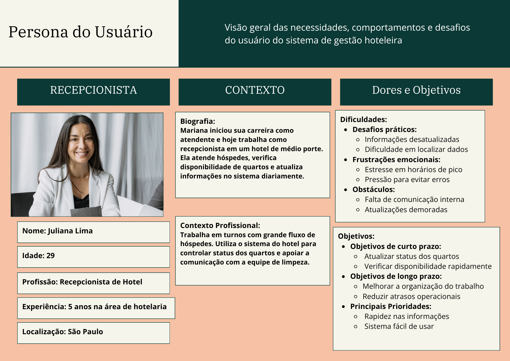

# 4. PROJETO DO DESIGN DE INTERAÇÃO

## 4.1 Personas
Nesta seção é apresentada a persona definida para representar um dos principais usuários do sistema HotelMind. A persona foi construída com base nas características dos usuários que utilizam o sistema diariamente, considerando suas necessidades, desafios e objetivos durante a utilização da plataforma.

A persona criada representa uma recepcionista de hotel, responsável por verificar a disponibilidade dos quartos, atualizar o status das ocupações e garantir a organização das informações no sistema. Essa persona foi utilizada para orientar o desenvolvimento das funcionalidades do sistema e facilitar a compreensão das necessidades dos usuários.

#### Figura 1: Persona da Recepcionista

## 4.2 Mapa de Empatia
O mapa de empatia foi desenvolvido com o objetivo de compreender melhor as necessidades, comportamentos e desafios da persona definida para o sistema HotelMind. A partir dessa ferramenta, foi possível identificar como o usuário pensa, sente, age e quais dificuldades enfrenta durante a utilização do sistema.

O mapa de empatia contribuiu para entender melhor as expectativas do usuário e apoiar o desenvolvimento de um sistema mais eficiente e adequado às suas necessidades.

#### Figura 1: Mapa de Empatia da Recepcionista

## 4.3 Protótipos das Interfaces
Apresente nesta seção os protótipos de alta fidelidade do sistema proposto. A fidelidade do protótipo refere-se ao nível de detalhes e funcionalidades incorporadas a ele. Assim, um protótipo de alta fidelidade é uma representação interativa do produto, baseada no computador ou em dispositivos móveis. Esse protótipo já apresenta maior semelhança com o design final em termos de detalhes e funcionalidades. No desenvolvimento dos protótipos, devem ser considerados os princípios gestálticos, as recomendações ergonômicas e as regras de design (como as 8 regras de ouro). É importante descrever no texto do relatório como os princípios gestálticos e as regras de ouro foram seguidas no projeto das interfaces. Nesta etapa deve-se dar uma ênfase na implementação do software de modo que possam ser realizados os testes com usuários na etapa seguinte.

## 4.4 Testes com Protótipos
Nesta seção você deve apresentar os testes realizados com usuários utilizando os protótipos de alta fidelidade desenvolvidos na seção anterior. O objetivo é avaliar a usabilidade, a clareza das informações e a adequação do design às necessidades das personas definidas no projeto.

Cada integrante do grupo deverá aplicar o teste com um usuário distinto, preferencialmente alinhado ao perfil das personas criadas. Devem ser definidas previamente as tarefas que o usuário deverá executar no protótipo (por exemplo: realizar um cadastro, buscar um produto, concluir uma compra).

Durante a aplicação do teste, registre observações sobre comportamentos, dúvidas, erros e comentários feitos pelo usuário, bem como o tempo necessário para a execução de cada tarefa. Ao final, colete o feedback do participante, destacando pontos positivos e aspectos a serem melhorados.

Os resultados obtidos por todos os integrantes devem ser consolidados, apresentando uma análise geral com os principais problemas encontrados, oportunidades de melhoria e as ações previstas para o projeto final. 
