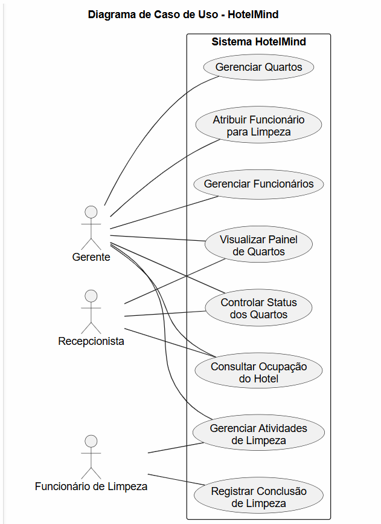

# 3. DOCUMENTO DE ESPECIFICAÇÃO DE REQUISITOS DE SOFTWARE
## 3.1 Objetivos deste documento
Descrever e especificar os requisitos do sistema de gerenciamento operacional de hotéis proposto neste trabalho. O documento tem como objetivo apresentar as funcionalidades, restrições e características do sistema, permitindo compreender como a aplicação poderá auxiliar no controle das operações internas do hotel, especialmente no gerenciamento de quartos, organização das atividades de limpeza e visualização da ocupação do estabelecimento.

## 3.2 Escopo do produto

### 3.2.1 Nome do produto e seus componentes principais
O produto será denominado **HotelMind – Sistema de Gestão de Hotéis**. O sistema será composto por três componentes principais:

#### Gestão de Quartos
Responsável pelo cadastro, consulta e atualização das informações dos quartos do hotel, incluindo número, tipo e status operacional.

#### Gestão de Limpeza
Responsável pelo registro e acompanhamento das atividades de limpeza dos quartos, permitindo atribuir tarefas aos funcionários responsáveis.

#### Painel de Ocupação
Responsável por apresentar uma visão geral da situação do hotel, permitindo visualizar rapidamente a quantidade de quartos disponíveis, ocupados e em limpeza.

### 3.2.2 Missão do produto
Centralizar e organizar as informações operacionais relacionadas ao funcionamento do hotel, permitindo acompanhar o status dos quartos, registrar atividades de limpeza e visualizar a ocupação do estabelecimento, contribuindo para melhorar a comunicação entre os setores e apoiar a gestão das operações diárias.

### 3.2.3 Limites do produto
O sistema não contempla funcionalidades de sistemas completos de gestão hoteleira, como reservas online, controle financeiro, cadastro detalhado de hóspedes ou integrações externas.

### 3.2.4 Benefícios do produto

| # | Benefício | Valor para o Cliente |
|---|--------------------------------|----------------|
| 1 | Organização das informações operacionais do hotel | Essencial |
| 2 | Visualização rápida do status dos quartos | Essencial |
| 3 | Melhor comunicação entre recepção e equipe de limpeza | Essencial |
| 4 | Acompanhamento da ocupação do hotel em tempo real | Recomendável |
| 5 | Redução de falhas operacionais relacionadas à preparação dos quartos | Recomendável |

## 3.3 Descrição geral do produto

### 3.3.1 Requisitos Funcionais

| Código | Requisito Funcional (Funcionalidade) | Descrição |
|------|--------------------------------------|-----------|
| RF1 | Gerenciar quartos | Processamento de inclusão, alteração, exclusão e consulta de quartos do hotel, contendo informações como número, tipo e status. |
| RF2 | Controlar status de quartos | Permitir atualizar e consultar o status dos quartos (disponível, ocupado, em limpeza ou manutenção). |
| RF3 | Gerenciar atividades de limpeza | Processamento de registro, alteração e consulta das atividades de limpeza associadas aos quartos. |
| RF4 | Atribuir funcionário para limpeza | Permitir atribuir funcionários responsáveis pelas atividades de limpeza dos quartos. |
| RF5 | Registrar conclusão de limpeza | Permitir registrar a conclusão das tarefas de limpeza realizadas nos quartos. |
| RF6 | Visualizar painel de quartos | Permitir visualizar todos os quartos do hotel e seus respectivos status em um painel centralizado. |
| RF7 | Consultar ocupação do hotel | Permitir visualizar a quantidade de quartos ocupados, disponíveis e em limpeza. |
| RF8 | Gerenciar Funcionários | Permitir ao gerente o cadastro, alteração, exclusão e consulta de funcionários do hotel, como recepcionistas e equipe de limpeza. |

### 3.3.2 Requisitos Não Funcionais

| Código | Requisito Não Funcional (Restrição) |
|------|-------------------------------------|
| RNF1 | O sistema deverá possuir interface simples e intuitiva para facilitar o uso por funcionários do hotel. |
| RNF2 | O sistema deverá ser acessado por meio de navegador web, sem necessidade de instalação local. |
| RNF3 | O sistema deverá apresentar tempo de resposta inferior a 5 segundos para consultas e atualizações. |
| RNF4 | O sistema deverá garantir a integridade e consistência das informações armazenadas no banco de dados. |
| RNF5 | O sistema deverá permitir autenticação de usuários por meio de login e senha. |
| RNF6 | O sistema deverá registrar alterações realizadas no status dos quartos e atividades de limpeza. |
| RNF7 | O sistema deverá permitir acesso simultâneo de múltiplos usuários. |
| RNF8 | O sistema deverá armazenar os dados de forma segura, protegendo informações contra acessos não autorizados. |

### 3.3.3 Usuários 

| Ator | Descrição |
|------|-----------|
| Gerente | Usuário responsável pela supervisão das operações do hotel, podendo visualizar ocupação, status dos quartos, atividades de limpeza e gerenciar os funcionários. Possui acesso geral ao sistema. |
| Recepcionista | Usuário responsável por consultar o status dos quartos e atualizar informações relacionadas à ocupação e disponibilidade. |
| Funcionário de Limpeza | Usuário responsável por visualizar e registrar atividades de limpeza dos quartos. |

## 3.4 Modelagem do Sistema
 
### 3.4.1 Descrições de Casos de Uso
Cada diagrama apresentado na seção anterior representa um conjunto de casos de uso relacionados às funcionalidades do sistema HotelMind. A seguir são apresentadas as descrições correspondentes aos casos de uso presentes em cada diagrama.

### Diagrama 1 — Gestão de Quartos
O Diagrama 1 representa as funcionalidades relacionadas ao gerenciamento e controle dos quartos do hotel, permitindo o cadastro, atualização de status e visualização das informações dos quartos.

## Casos de uso do Diagrama 1:
### Efetuar Login
* Atores: Gerente e Recepcionista.

**Descrição:** Permite que o usuário se autentique no sistema para acessar as funcionalidades de acordo com seu perfil.

**Pré-condição:** O usuário deve estar previamente cadastrado no banco de dados.

### Fluxo Principal:

* O usuário insere suas credenciais (login/e-mail e senha).
* O sistema valida os dados.
* O sistema libera o acesso ao painel principal conforme o nível de permissão.

**Pós-condição:** O usuário está autenticado e a sessão é iniciada.

### Manter Cadastro de Quartos
* Ator Principal: Gerente.

**Descrição:** Gerenciamento completo (incluir, alterar, excluir e consultar) dos dados estruturais dos quartos.

**Pré-condição:** Gerente deve estar logado.

### Fluxo Principal:

* O gerente acessa a área de "Configurações de Quartos".
* O gerente escolhe entre: Cadastrar Novo, Editar Existente ou Remover.
* O sistema solicita os dados (número, tipo, valor da diária, descrição).
* O sistema confirma a operação e salva os dados.

**Pós-condição:** A base de dados de quartos é atualizada.

### Atualizar Status do Quarto
* Atores: Gerente e Recepcionista.

**Descrição:** Altera a situação operacional de um quarto específico no sistema.

### Fluxo Principal:

* O usuário seleciona um quarto no sistema.
* O usuário escolhe o novo status (Ex: Disponível, Ocupado, Limpeza, Manutenção).
* O sistema registra a alteração e o horário da mudança.

**Regra de Negócio:** Um quarto com status "Ocupado" não pode ter seu status alterado diretamente para "Disponível" sem passar por "Limpeza" (opcional, dependendo da regra do hotel).

### Consultar Painel de Ocupação
* Atores: Gerente e Recepcionista.

**Descrição:** Interface visual que permite a visualização rápida da situação de todos os quartos do hotel.

### Fluxo Principal:

* O usuário acessa a tela de "Mapa de Quartos".
* O sistema exibe uma grade visual com cores distintas para cada status.
* O usuário pode filtrar por andar ou tipo de quarto.

**Pós-condição:** O usuário obtém uma visão geral da disponibilidade do hotel em tempo real.

## Diagrama 2 — Gestão de Limpeza

O Diagrama 2 representa as funcionalidades relacionadas ao gerenciamento das atividades de limpeza dos quartos e à atribuição de funcionários responsáveis.

### Atribuir Funcionário à Limpeza
* Ator Principal: Gerente.

**Descrição:** Permite que o gerente selecione um quarto (geralmente com status "Sujo" ou "Em Limpeza") e designe um funcionário específico para realizar o serviço.

**Pré-condição:** O quarto deve estar sinalizado como necessitando de limpeza; o funcionário deve estar cadastrado no sistema.

### Fluxo Principal:

* O gerente visualiza a lista de quartos que precisam de manutenção/limpeza.
* O gerente seleciona o quarto desejado.
* O sistema exibe a lista de funcionários de limpeza disponíveis.
* O gerente confirma a atribuição.

**Pós-condição:** O funcionário recebe a tarefa (em seu painel ou dispositivo) e o status do quarto é atualizado para "Limpeza em Andamento".

### Consultar Tarefas de Limpeza
* Ator Principal: Funcionário de Limpeza.

**Descrição:** Permite que o colaborador visualize quais quartos foram atribuídos a ele e quais as prioridades do dia.

### Fluxo Principal:

* O funcionário acessa o sistema.
* O sistema exibe uma lista filtrada apenas com as tarefas pendentes para aquele usuário.
* O funcionário visualiza detalhes (número do quarto, observações especiais).
  
**Pós-condição:** O funcionário tem as informações necessárias para iniciar o trabalho.

### Registrar Conclusão de Limpeza
* Ator Principal: Funcionário de Limpeza.

**Descrição:** O funcionário informa ao sistema que o quarto está higienizado e pronto para uma nova ocupação.

### Fluxo Principal:

* O funcionário seleciona a tarefa concluída em sua lista.
* O funcionário clica em "Finalizar Limpeza".
* O sistema solicita a confirmação (opcional: campo para observações, como "frigobar reposto").
* O sistema altera o status do quarto para "Disponível".

**Pós-condição:** O painel do recepcionista é atualizado automaticamente, liberando o quarto para novos hóspedes.

### Monitorar Atividades de Limpeza
* Ator Principal: Gerente.

**Descrição:** Visão gerencial de quanto tempo as limpezas estão levando e quais funcionários estão sobrecarregados. (Isso substitui ou detalha o "Gerenciar Atividades" que você sugeriu).

### Fluxo Principal:

* O gerente acessa o relatório ou painel de limpeza.
* O sistema exibe o histórico de limpezas concluídas e o tempo médio de execução.
* O gerente pode filtrar por funcionário ou período.

**Pós-condição:** O gerente obtém dados para avaliação de performance da equipe.

## Diagrama 3 — Ocupação e Administração

O Diagrama 3 representa as funcionalidades relacionadas ao controle da ocupação do hotel e ao gerenciamento dos funcionários.

### Consultar Dashboard de Ocupação
* Atores: Gerente e Recepcionista.

**Descrição:** Fornece uma visão analítica e quantitativa da situação do hotel (estatísticas), diferente do "Painel de Quartos" que é mais visual/individual.

### Fluxo Principal:

* O usuário acessa a aba "Relatórios" ou "Dashboard".
* O sistema calcula em tempo real:
- Taxa de Ocupação (%).
- Total de Quartos por categoria (Disponível, Ocupado, Limpeza, Manutenção).
- Previsão de Check-ins/Check-outs para o dia.
* O sistema exibe os dados em forma de resumo ou gráficos simples.

**Pós-condição:** O usuário tem uma visão macro para tomada de decisão (ex: "precisamos de mais gente na limpeza hoje").

### Manter Cadastro de Funcionários
* Ator Principal: Gerente.

**Descrição:** Gestão completa dos dados dos colaboradores e seus níveis de acesso ao sistema.

**Pré-condição:** Acesso restrito apenas ao perfil "Gerente".

### Fluxo Principal:

* O gerente acessa o módulo "Administração > Funcionários".
* O gerente pode Cadastrar (Nome, CPF, Cargo, Turno), Editar, Consultar ou Desativar um funcionário.
* Ao cadastrar, o gerente define o Nível de Acesso (Ex: Recepcionista só vê quartos; Limpeza só vê tarefas).

**Regra de Negócio:** O sistema não deve permitir a exclusão física de funcionários que possuam históricos de atividades (limpezas ou check-ins) para auditoria, apenas a "desativação".

### Visualizar Painel de Quartos (Mapa de Grade)
* Atores: Gerente e Recepcionista.

**Descrição:** Interface de grade que mostra a disposição física dos quartos.

### Fluxo Principal:

* O usuário abre o "Mapa Hoteleiro".
* O sistema renderiza cada quarto como um bloco colorido.
* Ao clicar em um quarto ocupado, o sistema exibe um resumo (Nome do hóspede e data de saída).

#### Figura: Diagrama de Casos de Uso 

### 3.4.2 Diagrama de Classes 

Figura 4 apresenta o diagrama de classes do sistema HotelMind. O modelo foi estruturado com foco nas funcionalidades previstas no escopo do sistema, especialmente no gerenciamento de quartos, controle de status, atividades de limpeza, controle da ocupação do hotel e gerenciamento de funcionários.

A classe Quarto representa uma das entidades centrais do sistema, armazenando informações como número, tipo e status operacional. A classe AtividadeLimpeza está relacionada ao acompanhamento das tarefas de limpeza dos quartos, permitindo registrar, atribuir responsáveis e concluir atividades. Já a classe PainelOcupacao concentra a visualização geral da situação do hotel, apresentando dados sobre quartos disponíveis, ocupados, em limpeza e em manutenção.

Para representar os usuários do sistema, foi definida a classe abstrata Usuario, responsável pelos dados de autenticação. A partir dela, a classe Funcionario é especializada em perfis como Gerente, Recepcionista e FuncionarioLimpeza, cada um com responsabilidades específicas dentro da operação do hotel. Além disso, a classe HistoricoStatus foi incluída para registrar alterações realizadas no status dos quartos, contribuindo para o controle e rastreabilidade das operações do sistema.
#### Figura 2: Diagrama de Classes do Sistema.
 

### 3.4.4 Descrições das Classes

| # | Nome | Descrição |
|---|------|-----------|
| 1 | Cliente | Cadastro de informações relativas aos clientes do hotel. |
| 2 | Quarto | Cadastro e controle das informações dos quartos, como número, tipo e status. |
| 3 | Funcionario | Cadastro dos funcionários responsáveis pelas operações do sistema. |
| 4 | Hospedagem | Registro das informações de ocupação dos quartos pelos clientes. |
| 5 | AtividadeLimpeza | Registro e acompanhamento das atividades de limpeza dos quartos. |
