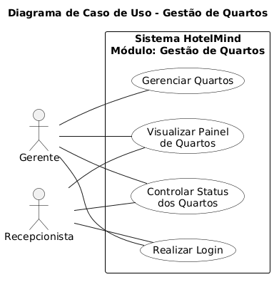
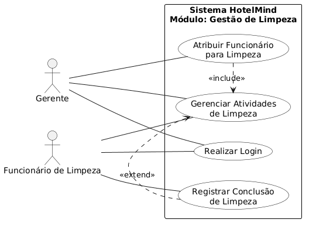
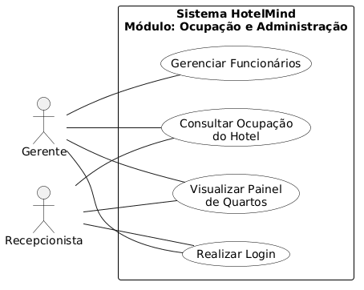

# 3. DOCUMENTO DE ESPECIFICAÇÃO DE REQUISITOS DE SOFTWARE
## 3.1 Objetivos deste documento
Descrever e especificar os requisitos do sistema de gerenciamento operacional de hotéis proposto neste trabalho. O documento tem como objetivo apresentar as funcionalidades, restrições e características do sistema, permitindo compreender como a aplicação poderá auxiliar no controle das operações internas do hotel, especialmente no gerenciamento de quartos, organização das atividades de limpeza e visualização da ocupação do estabelecimento.

## 3.2 Escopo do produto

### 3.2.1 Nome do produto e seus componentes principais
O produto será denominado **HotelMind – Sistema de Gestão de Hotéis**. O sistema será composto por três componentes principais:

#### Gestão de Quartos
Responsável pelo cadastro, consulta e atualização das informações dos quartos do hotel, incluindo número, tipo e status operacional.

#### Gestão de Limpeza
Responsável pelo registro e acompanhamento das atividades de limpeza dos quartos, permitindo atribuir tarefas aos funcionários responsáveis.

#### Painel de Ocupação
Responsável por apresentar uma visão geral da situação do hotel, permitindo visualizar rapidamente a quantidade de quartos disponíveis, ocupados e em limpeza.

### 3.2.2 Missão do produto
Centralizar e organizar as informações operacionais relacionadas ao funcionamento do hotel, permitindo acompanhar o status dos quartos, registrar atividades de limpeza e visualizar a ocupação do estabelecimento, contribuindo para melhorar a comunicação entre os setores e apoiar a gestão das operações diárias.

### 3.2.3 Limites do produto
O sistema não contempla funcionalidades de sistemas completos de gestão hoteleira, como reservas online, controle financeiro, cadastro detalhado de hóspedes ou integrações externas.

### 3.2.4 Benefícios do produto

| # | Benefício | Valor para o Cliente |
|---|--------------------------------|----------------|
| 1 | Organização das informações operacionais do hotel | Essencial |
| 2 | Visualização rápida do status dos quartos | Essencial |
| 3 | Melhor comunicação entre recepção e equipe de limpeza | Essencial |
| 4 | Acompanhamento da ocupação do hotel em tempo real | Recomendável |
| 5 | Redução de falhas operacionais relacionadas à preparação dos quartos | Recomendável |

## 3.3 Descrição geral do produto

### 3.3.1 Requisitos Funcionais

| Código | Requisito Funcional (Funcionalidade) | Descrição |
|------|--------------------------------------|-----------|
| RF1 | Gerenciar quartos | Processamento de inclusão, alteração, exclusão e consulta de quartos do hotel, contendo informações como número, tipo e status. |
| RF2 | Controlar status de quartos | Permitir atualizar e consultar o status dos quartos (disponível, ocupado, em limpeza ou manutenção). |
| RF3 | Gerenciar atividades de limpeza | Processamento de registro, alteração e consulta das atividades de limpeza associadas aos quartos. |
| RF4 | Atribuir funcionário para limpeza | Permitir atribuir funcionários responsáveis pelas atividades de limpeza dos quartos. |
| RF5 | Registrar conclusão de limpeza | Permitir registrar a conclusão das tarefas de limpeza realizadas nos quartos. |
| RF6 | Visualizar painel de quartos | Permitir visualizar todos os quartos do hotel e seus respectivos status em um painel centralizado. |
| RF7 | Consultar ocupação do hotel | Permitir visualizar a quantidade de quartos ocupados, disponíveis e em limpeza. |
| RF8 | Gerenciar Funcionários | Permitir ao gerente o cadastro, alteração, exclusão e consulta de funcionários do hotel, como recepcionistas e equipe de limpeza. |

### 3.3.2 Requisitos Não Funcionais

| Código | Requisito Não Funcional (Restrição) |
|------|-------------------------------------|
| RNF1 | O sistema deverá possuir interface simples e intuitiva para facilitar o uso por funcionários do hotel. |
| RNF2 | O sistema deverá ser acessado por meio de navegador web, sem necessidade de instalação local. |
| RNF3 | O sistema deverá apresentar tempo de resposta inferior a 5 segundos para consultas e atualizações. |
| RNF4 | O sistema deverá garantir a integridade e consistência das informações armazenadas no banco de dados. |
| RNF5 | O sistema deverá permitir autenticação de usuários por meio de login e senha. |
| RNF6 | O sistema deverá registrar alterações realizadas no status dos quartos e atividades de limpeza. |
| RNF7 | O sistema deverá permitir acesso simultâneo de múltiplos usuários. |
| RNF8 | O sistema deverá armazenar os dados de forma segura, protegendo informações contra acessos não autorizados. |

### 3.3.3 Usuários 

| Ator | Descrição |
|------|-----------|
| Gerente | Usuário responsável pela supervisão das operações do hotel, podendo visualizar ocupação, status dos quartos, atividades de limpeza e gerenciar os funcionários. Possui acesso geral ao sistema. |
| Recepcionista | Usuário responsável por consultar o status dos quartos e atualizar informações relacionadas à ocupação e disponibilidade. |
| Funcionário de Limpeza | Usuário responsável por visualizar e registrar atividades de limpeza dos quartos. |

## 3.4 Modelagem do Sistema
 
### 3.4.1 Descrições de Casos de Uso
Cada diagrama apresentado na seção anterior representa um conjunto de casos de uso relacionados às funcionalidades do sistema HotelMind. A seguir são apresentadas as descrições correspondentes aos casos de uso presentes em cada diagrama.

### Diagrama 1 — Gestão de Quartos
O Diagrama 1 representa as funcionalidades relacionadas ao gerenciamento e controle dos quartos do hotel, permitindo o cadastro, atualização de status e visualização das informações dos quartos.

## Casos de uso do Diagrama 1:
## Realizar Login
Permite que o gerente e o recepcionista acessem o sistema utilizando login e senha.
## Gerenciar Quartos
Permite ao gerente cadastrar, alterar, excluir e consultar informações dos quartos do hotel.
## Controlar Status dos Quartos
Permite ao gerente e ao recepcionista atualizar o status dos quartos, como disponível, ocupado, em limpeza ou manutenção.
## Visualizar Painel de Quartos
Permite ao gerente e ao recepcionista visualizar todos os quartos do hotel e seus respectivos status.
#### Figura 1: Diagrama de Caso de Uso Gestão de quartos

#### Diagrama 2 — Gestão de Limpeza

O Diagrama 2 representa as funcionalidades relacionadas ao gerenciamento das atividades de limpeza dos quartos e à atribuição de funcionários responsáveis.

#### Casos de uso do Diagrama 2:
#### Realizar Login
Permite que o gerente e o funcionário de limpeza acessem o sistema por meio de autenticação.
#### Gerenciar Atividades de Limpeza
Permite registrar e acompanhar as atividades de limpeza realizadas nos quartos.
#### Atribuir Funcionário para Limpeza
Permite ao gerente designar um funcionário responsável pela limpeza de um quarto.
#### Registrar Conclusão de Limpeza
Permite ao funcionário de limpeza registrar que a atividade de limpeza foi concluída.
#### Figura 2: Diagrama de Casos de Uso Gestão de Limpeza

### Diagrama 3 — Ocupação e Administração

O Diagrama 3 representa as funcionalidades relacionadas ao controle da ocupação do hotel e ao gerenciamento dos funcionários.

## Casos de uso do Diagrama 3:
## Realizar Login
Permite que o gerente e o recepcionista acessem o sistema utilizando suas credenciais.
## Visualizar Painel de Quartos
Permite visualizar o status geral dos quartos do hotel.
## Consultar Ocupação do Hotel
Permite ao gerente e ao recepcionista visualizar a quantidade de quartos disponíveis, ocupados e em limpeza.
## Gerenciar Funcionários
Permite ao gerente cadastrar, editar, excluir e consultar informações dos funcionários do hotel.

#### Figura : Diagrama de Casos de Uso Ocupação e Administração

### 3.4.3 Diagrama de Classes 

A Figura 2 mostra o diagrama de classes do sistema. A Matrícula deve conter a identificação do funcionário responsável pelo registro, bem com os dados do aluno e turmas. Para uma disciplina podemos ter diversas turmas, mas apenas um professor responsável por ela.

#### Figura 2: Diagrama de Classes do Sistema.
 

### 3.4.4 Descrições das Classes 

| # | Nome | Descrição |
|--------------------|------------------------------------|----------------------------------------|
| 1	|	Aluno |	Cadastro de informações relativas aos alunos. |
| 2	| Curso |	Cadastro geral de cursos de aperfeiçoamento. |
| 3 |	Matrícula |	Cadastro de Matrículas de alunos nos cursos. |
| 4 |	Turma |	Cadastro de turmas.
| 5	|	Professor |	Cadastro geral de professores que ministram as disciplinas. |
| ... |	... |	... |
